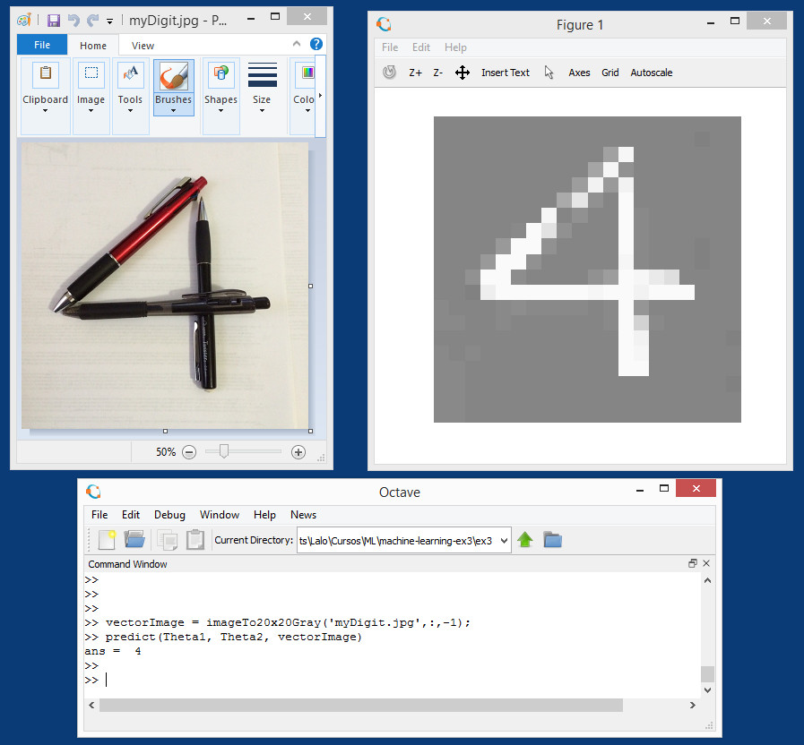
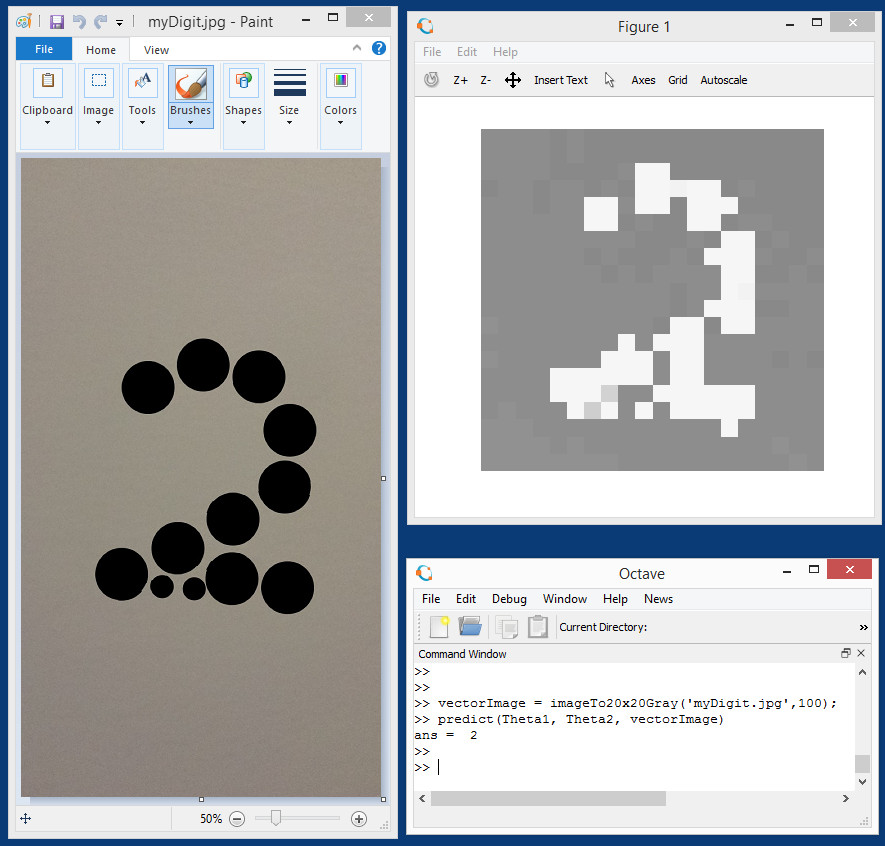

<section class="rc-CourseReferencesPage"><h1 class="cds-137 css-1d8uksr cds-139" tabindex="-1">Week 5 Lecture Notes </h1>

<h1>ML:Neural Networks: Learning</h1><h1>Cost Function</h1>
Let's first define a few variables that we will need to use:

a) L= total number of layers in the network

b) <math xmlns="http://www.w3.org/1998/Math/MathML"><semantics><mrow><msub><mi>s</mi><mi>l</mi></msub></mrow><annotation encoding="application/x-tex">s_l</annotation></semantics></math>sl​ = number of units (not counting bias unit) in layer l

c) K= number of output units/classes

Recall that in neural networks, we may have many output nodes. We denote <math xmlns="http://www.w3.org/1998/Math/MathML"><semantics><mrow><msub><mi>h</mi><mi mathvariant="normal">Θ</mi></msub><mo stretchy="false">(</mo><mi>x</mi><msub><mo stretchy="false">)</mo><mi>k</mi></msub></mrow><annotation encoding="application/x-tex">h_\Theta(x)_k</annotation></semantics></math>hΘ​(x)k​ as being a hypothesis that results in the <math xmlns="http://www.w3.org/1998/Math/MathML"><semantics><mrow><msup><mi>k</mi><mrow><mi>t</mi><mi>h</mi></mrow></msup></mrow><annotation encoding="application/x-tex">k^{th}</annotation></semantics></math>kth output.

Our cost function for neural networks is going to be a generalization of the one we used for logistic regression.

Recall that the cost function for regularized logistic regression was:
<table><tbody><tr><td>
<math xmlns="http://www.w3.org/1998/Math/MathML"><semantics><mrow><mi>J</mi><mo stretchy="false">(</mo><mi>θ</mi><mo stretchy="false">)</mo><mo>=</mo><mo>−</mo><mfrac><mn>1</mn><mi>m</mi></mfrac><msubsup><mo>∑</mo><mrow><mi>i</mi><mo>=</mo><mn>1</mn></mrow><mi>m</mi></msubsup><mstyle mathsize="1.2em"><mo stretchy="false">[</mo><msup><mi>y</mi><mrow><mo stretchy="false">(</mo><mi>i</mi><mo stretchy="false">)</mo></mrow></msup><mtext>&nbsp;</mtext><mi>log</mi><mo>⁡</mo><mo stretchy="false">(</mo><msub><mi>h</mi><mi>θ</mi></msub><mo stretchy="false">(</mo><msup><mi>x</mi><mrow><mo stretchy="false">(</mo><mi>i</mi><mo stretchy="false">)</mo></mrow></msup><mo stretchy="false">)</mo><mo stretchy="false">)</mo><mo>+</mo><mo stretchy="false">(</mo><mn>1</mn><mo>−</mo><msup><mi>y</mi><mrow><mo stretchy="false">(</mo><mi>i</mi><mo stretchy="false">)</mo></mrow></msup><mo stretchy="false">)</mo><mtext>&nbsp;</mtext><mi>log</mi><mo>⁡</mo><mo stretchy="false">(</mo><mn>1</mn><mo>−</mo><msub><mi>h</mi><mi>θ</mi></msub><mo stretchy="false">(</mo><msup><mi>x</mi><mrow><mo stretchy="false">(</mo><mi>i</mi><mo stretchy="false">)</mo></mrow></msup><mo stretchy="false">)</mo><mo stretchy="false">)</mo><mstyle mathsize="1.2em"><mo stretchy="false">]</mo><mo>+</mo><mfrac><mi>λ</mi><mrow><mn>2</mn><mi>m</mi></mrow></mfrac><msubsup><mo>∑</mo><mrow><mi>j</mi><mo>=</mo><mn>1</mn></mrow><mi>n</mi></msubsup><msubsup><mi>θ</mi><mi>j</mi><mn>2</mn></msubsup></mstyle></mstyle></mrow><annotation encoding="application/x-tex">J(\theta) = - \frac{1}{m} \sum_{i=1}^m \large[ y^{(i)}\ \log (h_\theta (x^{(i)})) + (1 - y^{(i)})\ \log (1 - h_\theta(x^{(i)}))\large] + \frac{\lambda}{2m}\sum_{j=1}^n \theta_j^2</annotation></semantics></math>J(θ)=−m1​∑i=1m​[y(i)&nbsp;log(hθ​(x(i)))+(1−y(i))&nbsp;log(1−hθ​(x(i)))]+2mλ​∑j=1n​θj2​
</td></tr></tbody></table>
For neural networks, it is going to be slightly more complicated:
<table><tbody><tr><td>
<nobr>J(Θ)=−1m∑i=1m∑k=1K[y(i)klog((hΘ(x(i)))k)+(1−y(i)k)log(1−(hΘ(x(i)))k)]+λ2m∑l=1L−1∑i=1sl∑j=1sl+1(Θ(l)j,i)2</nobr>
</td></tr></tbody></table>
We have added a few nested summations to account for our multiple output nodes. In the first part of the equation, between the square brackets, we have an additional nested summation that loops through the number of output nodes.

In the regularization part, after the square brackets, we must account for multiple theta matrices. The number of columns in our current theta matrix is equal to the number of nodes in our current layer (including the bias unit). The number of rows in our current theta matrix is equal to the number of nodes in the next layer (excluding the bias unit). As before with logistic regression, we square every term.

Note:
<ul><li>
the double sum simply adds up the logistic regression costs calculated for each cell in the output layer; and
</li><li>
the triple sum simply adds up the squares of all the individual Θs in the entire network.
</li><li>
the i in the triple sum does <strong>not</strong> refer to training example i
</li></ul><h1>Backpropagation Algorithm</h1>
"Backpropagation" is neural-network terminology for minimizing our cost function, just like what we were doing with gradient descent in logistic and linear regression.

Our goal is to compute:

<math xmlns="http://www.w3.org/1998/Math/MathML"><semantics><mrow><msub><mo><mi>min</mi><mo>⁡</mo></mo><mi mathvariant="normal">Θ</mi></msub><mi>J</mi><mo stretchy="false">(</mo><mi mathvariant="normal">Θ</mi><mo stretchy="false">)</mo></mrow><annotation encoding="application/x-tex">\min_\Theta J(\Theta)</annotation></semantics></math>minΘ​J(Θ)

That is, we want to minimize our cost function J using an optimal set of parameters in theta.

In this section we'll look at the equations we use to compute the partial derivative of J(Θ):

<math xmlns="http://www.w3.org/1998/Math/MathML"><semantics><mrow><mstyle displaystyle="true" scriptlevel="0"><mfrac><mi mathvariant="normal">∂</mi><mrow><mi mathvariant="normal">∂</mi><msubsup><mi mathvariant="normal">Θ</mi><mrow><mi>i</mi><mo separator="true">,</mo><mi>j</mi></mrow><mrow><mo stretchy="false">(</mo><mi>l</mi><mo stretchy="false">)</mo></mrow></msubsup></mrow></mfrac></mstyle><mi>J</mi><mo stretchy="false">(</mo><mi mathvariant="normal">Θ</mi><mo stretchy="false">)</mo></mrow><annotation encoding="application/x-tex">\dfrac{\partial}{\partial \Theta_{i,j}^{(l)}}J(\Theta)</annotation></semantics></math>∂Θi,j(l)​∂​J(Θ)

In back propagation we're going to compute for every node:

<math xmlns="http://www.w3.org/1998/Math/MathML"><semantics><mrow><msubsup><mi>δ</mi><mi>j</mi><mrow><mo stretchy="false">(</mo><mi>l</mi><mo stretchy="false">)</mo></mrow></msubsup></mrow><annotation encoding="application/x-tex">\delta_j^{(l)}</annotation></semantics></math>δj(l)​ = "error" of node j in layer l

Recall that <math xmlns="http://www.w3.org/1998/Math/MathML"><semantics><mrow><msubsup><mi>a</mi><mi>j</mi><mrow><mo stretchy="false">(</mo><mi>l</mi><mo stretchy="false">)</mo></mrow></msubsup></mrow><annotation encoding="application/x-tex">a_j^{(l)}</annotation></semantics></math>aj(l)​ is activation node j in layer l.

For the <strong>last layer</strong>, we can compute the vector of delta values with:

<math xmlns="http://www.w3.org/1998/Math/MathML"><semantics><mrow><msup><mi>δ</mi><mrow><mo stretchy="false">(</mo><mi>L</mi><mo stretchy="false">)</mo></mrow></msup><mo>=</mo><msup><mi>a</mi><mrow><mo stretchy="false">(</mo><mi>L</mi><mo stretchy="false">)</mo></mrow></msup><mo>−</mo><mi>y</mi></mrow><annotation encoding="application/x-tex">\delta^{(L)} = a^{(L)} - y</annotation></semantics></math>δ(L)=a(L)−y

Where L is our total number of layers and <math xmlns="http://www.w3.org/1998/Math/MathML"><semantics><mrow><msup><mi>a</mi><mrow><mo stretchy="false">(</mo><mi>L</mi><mo stretchy="false">)</mo></mrow></msup></mrow><annotation encoding="application/x-tex">a^{(L)}</annotation></semantics></math>a(L) is the vector of outputs of the activation units for the last layer. So our "error values" for the last layer are simply the differences of our actual results in the last layer and the correct outputs in y.

To get the delta values of the layers before the last layer, we can use an equation that steps us back from right to left:
<table><tbody><tr><td>
<math xmlns="http://www.w3.org/1998/Math/MathML"><semantics><mrow><msup><mi>δ</mi><mrow><mo stretchy="false">(</mo><mi>l</mi><mo stretchy="false">)</mo></mrow></msup><mo>=</mo><mo stretchy="false">(</mo><mo stretchy="false">(</mo><msup><mi mathvariant="normal">Θ</mi><mrow><mo stretchy="false">(</mo><mi>l</mi><mo stretchy="false">)</mo></mrow></msup><msup><mo stretchy="false">)</mo><mi>T</mi></msup><msup><mi>δ</mi><mrow><mo stretchy="false">(</mo><mi>l</mi><mo>+</mo><mn>1</mn><mo stretchy="false">)</mo></mrow></msup><mo stretchy="false">)</mo><mtext>&nbsp;</mtext><mi mathvariant="normal">.</mi><mo>∗</mo><mtext>&nbsp;</mtext><msup><mi>g</mi><mo mathvariant="normal" lspace="0em" rspace="0em">′</mo></msup><mo stretchy="false">(</mo><msup><mi>z</mi><mrow><mo stretchy="false">(</mo><mi>l</mi><mo stretchy="false">)</mo></mrow></msup><mo stretchy="false">)</mo></mrow><annotation encoding="application/x-tex">\delta^{(l)} = ((\Theta^{(l)})^T \delta^{(l+1)})\ .*\ g'(z^{(l)})</annotation></semantics></math>δ(l)=((Θ(l))Tδ(l+1))&nbsp;.∗&nbsp;g′(z(l))
</td></tr></tbody></table>
The delta values of layer l are calculated by multiplying the delta values in the next layer with the theta matrix of layer l. We then element-wise multiply that with a function called g', or g-prime, which is the derivative of the activation function g evaluated with the input values given by z(l).

The g-prime derivative terms can also be written out as:
<table><tbody><tr><td>
<math xmlns="http://www.w3.org/1998/Math/MathML"><semantics><mrow><msup><mi>g</mi><mo mathvariant="normal" lspace="0em" rspace="0em">′</mo></msup><mo stretchy="false">(</mo><mi>u</mi><mo stretchy="false">)</mo><mo>=</mo><mi>g</mi><mo stretchy="false">(</mo><mi>u</mi><mo stretchy="false">)</mo><mtext>&nbsp;</mtext><mi mathvariant="normal">.</mi><mo>∗</mo><mtext>&nbsp;</mtext><mo stretchy="false">(</mo><mn>1</mn><mo>−</mo><mi>g</mi><mo stretchy="false">(</mo><mi>u</mi><mo stretchy="false">)</mo><mo stretchy="false">)</mo></mrow><annotation encoding="application/x-tex">g'(u) = g(u)\ .*\ (1 - g(u))</annotation></semantics></math>g′(u)=g(u)&nbsp;.∗&nbsp;(1−g(u))
</td></tr></tbody></table>
The full back propagation equation for the inner nodes is then:
<table><tbody><tr><td>
<math xmlns="http://www.w3.org/1998/Math/MathML"><semantics><mrow><msup><mi>δ</mi><mrow><mo stretchy="false">(</mo><mi>l</mi><mo stretchy="false">)</mo></mrow></msup><mo>=</mo><mo stretchy="false">(</mo><mo stretchy="false">(</mo><msup><mi mathvariant="normal">Θ</mi><mrow><mo stretchy="false">(</mo><mi>l</mi><mo stretchy="false">)</mo></mrow></msup><msup><mo stretchy="false">)</mo><mi>T</mi></msup><msup><mi>δ</mi><mrow><mo stretchy="false">(</mo><mi>l</mi><mo>+</mo><mn>1</mn><mo stretchy="false">)</mo></mrow></msup><mo stretchy="false">)</mo><mtext>&nbsp;</mtext><mi mathvariant="normal">.</mi><mo>∗</mo><mtext>&nbsp;</mtext><msup><mi>a</mi><mrow><mo stretchy="false">(</mo><mi>l</mi><mo stretchy="false">)</mo></mrow></msup><mtext>&nbsp;</mtext><mi mathvariant="normal">.</mi><mo>∗</mo><mtext>&nbsp;</mtext><mo stretchy="false">(</mo><mn>1</mn><mo>−</mo><msup><mi>a</mi><mrow><mo stretchy="false">(</mo><mi>l</mi><mo stretchy="false">)</mo></mrow></msup><mo stretchy="false">)</mo></mrow><annotation encoding="application/x-tex">\delta^{(l)} = ((\Theta^{(l)})^T \delta^{(l+1)})\ .*\ a^{(l)}\ .*\ (1 - a^{(l)})</annotation></semantics></math>δ(l)=((Θ(l))Tδ(l+1))&nbsp;.∗&nbsp;a(l)&nbsp;.∗&nbsp;(1−a(l))
</td></tr></tbody></table>
A. Ng states that the derivation and proofs are complicated and involved, but you can still implement the above equations to do back propagation without knowing the details.

We can compute our partial derivative terms by multiplying our activation values and our error values for each training example t:
<table><tbody><tr><td>
<math xmlns="http://www.w3.org/1998/Math/MathML"><semantics><mrow><mstyle displaystyle="true" scriptlevel="0"><mfrac><mrow><mi mathvariant="normal">∂</mi><mi>J</mi><mo stretchy="false">(</mo><mi mathvariant="normal">Θ</mi><mo stretchy="false">)</mo></mrow><mrow><mi mathvariant="normal">∂</mi><msubsup><mi mathvariant="normal">Θ</mi><mrow><mi>i</mi><mo separator="true">,</mo><mi>j</mi></mrow><mrow><mo stretchy="false">(</mo><mi>l</mi><mo stretchy="false">)</mo></mrow></msubsup></mrow></mfrac></mstyle><mo>=</mo><mfrac><mn>1</mn><mi>m</mi></mfrac><msubsup><mo>∑</mo><mrow><mi>t</mi><mo>=</mo><mn>1</mn></mrow><mi>m</mi></msubsup><msubsup><mi>a</mi><mi>j</mi><mrow><mo stretchy="false">(</mo><mi>t</mi><mo stretchy="false">)</mo><mo stretchy="false">(</mo><mi>l</mi><mo stretchy="false">)</mo></mrow></msubsup><msubsup><mi>δ</mi><mi>i</mi><mrow><mo stretchy="false">(</mo><mi>t</mi><mo stretchy="false">)</mo><mo stretchy="false">(</mo><mi>l</mi><mo>+</mo><mn>1</mn><mo stretchy="false">)</mo></mrow></msubsup></mrow><annotation encoding="application/x-tex">\dfrac{\partial J(\Theta)}{\partial \Theta_{i,j}^{(l)}} = \frac{1}{m}\sum_{t=1}^m a_j^{(t)(l)} {\delta}_i^{(t)(l+1)}</annotation></semantics></math>∂Θi,j(l)​∂J(Θ)​=m1​∑t=1m​aj(t)(l)​δi(t)(l+1)​
</td></tr></tbody></table>
This however ignores regularization, which we'll deal with later.

Note: <math xmlns="http://www.w3.org/1998/Math/MathML"><semantics><mrow><msup><mi>δ</mi><mrow><mi>l</mi><mo>+</mo><mn>1</mn></mrow></msup></mrow><annotation encoding="application/x-tex">\delta^{l+1}</annotation></semantics></math>δl+1 and  <math xmlns="http://www.w3.org/1998/Math/MathML"><semantics><mrow><msup><mi>a</mi><mrow><mi>l</mi><mo>+</mo><mn>1</mn></mrow></msup></mrow><annotation encoding="application/x-tex">a^{l+1}</annotation></semantics></math>al+1 are vectors with <math xmlns="http://www.w3.org/1998/Math/MathML"><semantics><mrow><msub><mi>s</mi><mrow><mi>l</mi><mo>+</mo><mn>1</mn></mrow></msub></mrow><annotation encoding="application/x-tex">s_{l+1}</annotation></semantics></math>sl+1​ elements. Similarly,  <math xmlns="http://www.w3.org/1998/Math/MathML"><semantics><mrow><mtext>&nbsp;</mtext><msup><mi>a</mi><mrow><mo stretchy="false">(</mo><mi>l</mi><mo stretchy="false">)</mo></mrow></msup></mrow><annotation encoding="application/x-tex">\ a^{(l)}</annotation></semantics></math>&nbsp;a(l) is a vector with <math xmlns="http://www.w3.org/1998/Math/MathML"><semantics><mrow><msub><mi>s</mi><mi>l</mi></msub></mrow><annotation encoding="application/x-tex">s_l</annotation></semantics></math>sl​ elements. Multiplying them produces a matrix that is <math xmlns="http://www.w3.org/1998/Math/MathML"><semantics><mrow><msub><mi>s</mi><mrow><mi>l</mi><mo>+</mo><mn>1</mn></mrow></msub></mrow><annotation encoding="application/x-tex">s_{l+1}</annotation></semantics></math>sl+1​  by <math xmlns="http://www.w3.org/1998/Math/MathML"><semantics><mrow><msub><mi>s</mi><mi>l</mi></msub></mrow><annotation encoding="application/x-tex">s_l</annotation></semantics></math>sl​ which is the same dimension as <math xmlns="http://www.w3.org/1998/Math/MathML"><semantics><mrow><msup><mi mathvariant="normal">Θ</mi><mrow><mo stretchy="false">(</mo><mi>l</mi><mo stretchy="false">)</mo></mrow></msup></mrow><annotation encoding="application/x-tex">\Theta^{(l)}</annotation></semantics></math>Θ(l). That is, the process produces a gradient term for every element in <math xmlns="http://www.w3.org/1998/Math/MathML"><semantics><mrow><msup><mi mathvariant="normal">Θ</mi><mrow><mo stretchy="false">(</mo><mi>l</mi><mo stretchy="false">)</mo></mrow></msup></mrow><annotation encoding="application/x-tex">\Theta^{(l)}</annotation></semantics></math>Θ(l). (Actually, <math xmlns="http://www.w3.org/1998/Math/MathML"><semantics><mrow><msup><mi mathvariant="normal">Θ</mi><mrow><mo stretchy="false">(</mo><mi>l</mi><mo stretchy="false">)</mo></mrow></msup></mrow><annotation encoding="application/x-tex">\Theta^{(l)}</annotation></semantics></math>Θ(l) has <math xmlns="http://www.w3.org/1998/Math/MathML"><semantics><mrow><msub><mi>s</mi><mi>l</mi></msub></mrow><annotation encoding="application/x-tex">s_{l}</annotation></semantics></math>sl​ + 1 column, so the dimensionality is not exactly the same).

We can now take all these equations and put them together into a backpropagation algorithm:

<strong>Back propagation Algorithm</strong>

Given training set <math xmlns="http://www.w3.org/1998/Math/MathML"><semantics><mrow><mo stretchy="false">{</mo><mo stretchy="false">(</mo><msup><mi>x</mi><mrow><mo stretchy="false">(</mo><mn>1</mn><mo stretchy="false">)</mo></mrow></msup><mo separator="true">,</mo><msup><mi>y</mi><mrow><mo stretchy="false">(</mo><mn>1</mn><mo stretchy="false">)</mo></mrow></msup><mo stretchy="false">)</mo><mo>⋯</mo><mo stretchy="false">(</mo><msup><mi>x</mi><mrow><mo stretchy="false">(</mo><mi>m</mi><mo stretchy="false">)</mo></mrow></msup><mo separator="true">,</mo><msup><mi>y</mi><mrow><mo stretchy="false">(</mo><mi>m</mi><mo stretchy="false">)</mo></mrow></msup><mo stretchy="false">)</mo><mo stretchy="false">}</mo></mrow><annotation encoding="application/x-tex">\lbrace (x^{(1)}, y^{(1)}) \cdots (x^{(m)}, y^{(m)})\rbrace</annotation></semantics></math>{(x(1),y(1))⋯(x(m),y(m))}
<ul><li>
Set <math xmlns="http://www.w3.org/1998/Math/MathML"><semantics><mrow><msubsup><mi mathvariant="normal">Δ</mi><mrow><mi>i</mi><mo separator="true">,</mo><mi>j</mi></mrow><mrow><mo stretchy="false">(</mo><mi>l</mi><mo stretchy="false">)</mo></mrow></msubsup></mrow><annotation encoding="application/x-tex">\Delta^{(l)}_{i,j}</annotation></semantics></math>Δi,j(l)​ := 0 for all (l,i,j)
</li></ul>
For training example t =1 to m:
<ul><li>
Set <math xmlns="http://www.w3.org/1998/Math/MathML"><semantics><mrow><msup><mi>a</mi><mrow><mo stretchy="false">(</mo><mn>1</mn><mo stretchy="false">)</mo></mrow></msup><mo>:</mo><mo>=</mo><msup><mi>x</mi><mrow><mo stretchy="false">(</mo><mi>t</mi><mo stretchy="false">)</mo></mrow></msup></mrow><annotation encoding="application/x-tex">a^{(1)} := x^{(t)}</annotation></semantics></math>a(1):=x(t)
</li><li>
Perform forward propagation to compute <math xmlns="http://www.w3.org/1998/Math/MathML"><semantics><mrow><msup><mi>a</mi><mrow><mo stretchy="false">(</mo><mi>l</mi><mo stretchy="false">)</mo></mrow></msup></mrow><annotation encoding="application/x-tex">a^{(l)}</annotation></semantics></math>a(l) for l=2,3,…,L
</li><li>
Using <math xmlns="http://www.w3.org/1998/Math/MathML"><semantics><mrow><msup><mi>y</mi><mrow><mo stretchy="false">(</mo><mi>t</mi><mo stretchy="false">)</mo></mrow></msup></mrow><annotation encoding="application/x-tex">y^{(t)}</annotation></semantics></math>y(t), compute <math xmlns="http://www.w3.org/1998/Math/MathML"><semantics><mrow><msup><mi>δ</mi><mrow><mo stretchy="false">(</mo><mi>L</mi><mo stretchy="false">)</mo></mrow></msup><mo>=</mo><msup><mi>a</mi><mrow><mo stretchy="false">(</mo><mi>L</mi><mo stretchy="false">)</mo></mrow></msup><mo>−</mo><msup><mi>y</mi><mrow><mo stretchy="false">(</mo><mi>t</mi><mo stretchy="false">)</mo></mrow></msup></mrow><annotation encoding="application/x-tex">\delta^{(L)} = a^{(L)} - y^{(t)}</annotation></semantics></math>δ(L)=a(L)−y(t)
</li><li>
Compute <math xmlns="http://www.w3.org/1998/Math/MathML"><semantics><mrow><msup><mi>δ</mi><mrow><mo stretchy="false">(</mo><mi>L</mi><mo>−</mo><mn>1</mn><mo stretchy="false">)</mo></mrow></msup><mo separator="true">,</mo><msup><mi>δ</mi><mrow><mo stretchy="false">(</mo><mi>L</mi><mo>−</mo><mn>2</mn><mo stretchy="false">)</mo></mrow></msup><mo separator="true">,</mo><mo>…</mo><mo separator="true">,</mo><msup><mi>δ</mi><mrow><mo stretchy="false">(</mo><mn>2</mn><mo stretchy="false">)</mo></mrow></msup></mrow><annotation encoding="application/x-tex">\delta^{(L-1)}, \delta^{(L-2)},\dots,\delta^{(2)}</annotation></semantics></math>δ(L−1),δ(L−2),…,δ(2) using <math xmlns="http://www.w3.org/1998/Math/MathML"><semantics><mrow><msup><mi>δ</mi><mrow><mo stretchy="false">(</mo><mi>l</mi><mo stretchy="false">)</mo></mrow></msup><mo>=</mo><mo stretchy="false">(</mo><mo stretchy="false">(</mo><msup><mi mathvariant="normal">Θ</mi><mrow><mo stretchy="false">(</mo><mi>l</mi><mo stretchy="false">)</mo></mrow></msup><msup><mo stretchy="false">)</mo><mi>T</mi></msup><msup><mi>δ</mi><mrow><mo stretchy="false">(</mo><mi>l</mi><mo>+</mo><mn>1</mn><mo stretchy="false">)</mo></mrow></msup><mo stretchy="false">)</mo><mtext>&nbsp;</mtext><mi mathvariant="normal">.</mi><mo>∗</mo><mtext>&nbsp;</mtext><msup><mi>a</mi><mrow><mo stretchy="false">(</mo><mi>l</mi><mo stretchy="false">)</mo></mrow></msup><mtext>&nbsp;</mtext><mi mathvariant="normal">.</mi><mo>∗</mo><mtext>&nbsp;</mtext><mo stretchy="false">(</mo><mn>1</mn><mo>−</mo><msup><mi>a</mi><mrow><mo stretchy="false">(</mo><mi>l</mi><mo stretchy="false">)</mo></mrow></msup><mo stretchy="false">)</mo></mrow><annotation encoding="application/x-tex">\delta^{(l)} = ((\Theta^{(l)})^T \delta^{(l+1)})\ .*\ a^{(l)}\ .*\ (1 - a^{(l)})</annotation></semantics></math>δ(l)=((Θ(l))Tδ(l+1))&nbsp;.∗&nbsp;a(l)&nbsp;.∗&nbsp;(1−a(l))
</li><li>
<math xmlns="http://www.w3.org/1998/Math/MathML"><semantics><mrow><msubsup><mi mathvariant="normal">Δ</mi><mrow><mi>i</mi><mo separator="true">,</mo><mi>j</mi></mrow><mrow><mo stretchy="false">(</mo><mi>l</mi><mo stretchy="false">)</mo></mrow></msubsup><mo>:</mo><mo>=</mo><msubsup><mi mathvariant="normal">Δ</mi><mrow><mi>i</mi><mo separator="true">,</mo><mi>j</mi></mrow><mrow><mo stretchy="false">(</mo><mi>l</mi><mo stretchy="false">)</mo></mrow></msubsup><mo>+</mo><msubsup><mi>a</mi><mi>j</mi><mrow><mo stretchy="false">(</mo><mi>l</mi><mo stretchy="false">)</mo></mrow></msubsup><msubsup><mi>δ</mi><mi>i</mi><mrow><mo stretchy="false">(</mo><mi>l</mi><mo>+</mo><mn>1</mn><mo stretchy="false">)</mo></mrow></msubsup></mrow><annotation encoding="application/x-tex">\Delta^{(l)}_{i,j} := \Delta^{(l)}_{i,j} + a_j^{(l)} \delta_i^{(l+1)}</annotation></semantics></math>Δi,j(l)​:=Δi,j(l)​+aj(l)​δi(l+1)​ or with vectorization, <math xmlns="http://www.w3.org/1998/Math/MathML"><semantics><mrow><msup><mi mathvariant="normal">Δ</mi><mrow><mo stretchy="false">(</mo><mi>l</mi><mo stretchy="false">)</mo></mrow></msup><mo>:</mo><mo>=</mo><msup><mi mathvariant="normal">Δ</mi><mrow><mo stretchy="false">(</mo><mi>l</mi><mo stretchy="false">)</mo></mrow></msup><mo>+</mo><msup><mi>δ</mi><mrow><mo stretchy="false">(</mo><mi>l</mi><mo>+</mo><mn>1</mn><mo stretchy="false">)</mo></mrow></msup><mo stretchy="false">(</mo><msup><mi>a</mi><mrow><mo stretchy="false">(</mo><mi>l</mi><mo stretchy="false">)</mo></mrow></msup><msup><mo stretchy="false">)</mo><mi>T</mi></msup></mrow><annotation encoding="application/x-tex">\Delta^{(l)} := \Delta^{(l)} + \delta^{(l+1)}(a^{(l)})^T</annotation></semantics></math>Δ(l):=Δ(l)+δ(l+1)(a(l))T
</li><li>
<math xmlns="http://www.w3.org/1998/Math/MathML"><semantics><mrow><msubsup><mi>D</mi><mrow><mi>i</mi><mo separator="true">,</mo><mi>j</mi></mrow><mrow><mo stretchy="false">(</mo><mi>l</mi><mo stretchy="false">)</mo></mrow></msubsup><mo>:</mo><mo>=</mo><mstyle displaystyle="true" scriptlevel="0"><mfrac><mn>1</mn><mi>m</mi></mfrac></mstyle><mrow><mo fence="true">(</mo><msubsup><mi mathvariant="normal">Δ</mi><mrow><mi>i</mi><mo separator="true">,</mo><mi>j</mi></mrow><mrow><mo stretchy="false">(</mo><mi>l</mi><mo stretchy="false">)</mo></mrow></msubsup><mo>+</mo><mi>λ</mi><msubsup><mi mathvariant="normal">Θ</mi><mrow><mi>i</mi><mo separator="true">,</mo><mi>j</mi></mrow><mrow><mo stretchy="false">(</mo><mi>l</mi><mo stretchy="false">)</mo></mrow></msubsup><mo fence="true">)</mo></mrow></mrow><annotation encoding="application/x-tex">D^{(l)}_{i,j} := \dfrac{1}{m}\left(\Delta^{(l)}_{i,j} + \lambda\Theta^{(l)}_{i,j}\right)</annotation></semantics></math>Di,j(l)​:=m1​(Δi,j(l)​+λΘi,j(l)​) If j≠0 NOTE: Typo in lecture slide omits outside parentheses. This version is correct.
</li><li>
<math xmlns="http://www.w3.org/1998/Math/MathML"><semantics><mrow><msubsup><mi>D</mi><mrow><mi>i</mi><mo separator="true">,</mo><mi>j</mi></mrow><mrow><mo stretchy="false">(</mo><mi>l</mi><mo stretchy="false">)</mo></mrow></msubsup><mo>:</mo><mo>=</mo><mstyle displaystyle="true" scriptlevel="0"><mfrac><mn>1</mn><mi>m</mi></mfrac></mstyle><msubsup><mi mathvariant="normal">Δ</mi><mrow><mi>i</mi><mo separator="true">,</mo><mi>j</mi></mrow><mrow><mo stretchy="false">(</mo><mi>l</mi><mo stretchy="false">)</mo></mrow></msubsup></mrow><annotation encoding="application/x-tex">D^{(l)}_{i,j} := \dfrac{1}{m}\Delta^{(l)}_{i,j}</annotation></semantics></math>Di,j(l)​:=m1​Δi,j(l)​ If j=0
</li></ul>
The capital-delta matrix is used as an "accumulator" to add up our values as we go along and eventually compute our partial derivative.

The actual proof is quite involved, but, the <math xmlns="http://www.w3.org/1998/Math/MathML"><semantics><mrow><msubsup><mi>D</mi><mrow><mi>i</mi><mo separator="true">,</mo><mi>j</mi></mrow><mrow><mo stretchy="false">(</mo><mi>l</mi><mo stretchy="false">)</mo></mrow></msubsup></mrow><annotation encoding="application/x-tex">D^{(l)}_{i,j}</annotation></semantics></math>Di,j(l)​ terms are the partial derivatives and the results we are looking for:

<math xmlns="http://www.w3.org/1998/Math/MathML"><semantics><mrow><msubsup><mi>D</mi><mrow><mi>i</mi><mo separator="true">,</mo><mi>j</mi></mrow><mrow><mo stretchy="false">(</mo><mi>l</mi><mo stretchy="false">)</mo></mrow></msubsup><mo>=</mo><mstyle displaystyle="true" scriptlevel="0"><mfrac><mrow><mi mathvariant="normal">∂</mi><mi>J</mi><mo stretchy="false">(</mo><mi mathvariant="normal">Θ</mi><mo stretchy="false">)</mo></mrow><mrow><mi mathvariant="normal">∂</mi><msubsup><mi mathvariant="normal">Θ</mi><mrow><mi>i</mi><mo separator="true">,</mo><mi>j</mi></mrow><mrow><mo stretchy="false">(</mo><mi>l</mi><mo stretchy="false">)</mo></mrow></msubsup></mrow></mfrac></mstyle><mi mathvariant="normal">.</mi></mrow><annotation encoding="application/x-tex">D_{i,j}^{(l)} = \dfrac{\partial J(\Theta)}{\partial \Theta_{i,j}^{(l)}}.</annotation></semantics></math>Di,j(l)​=∂Θi,j(l)​∂J(Θ)​.
<h1>Backpropagation Intuition</h1>
The cost function is:
<table><tbody><tr><td>
<nobr>J(θ)=−1m∑t=1m∑k=1K[y(t)k&nbsp;log(hθ(x(t)))k+(1−y(t)k)&nbsp;log(1−hθ(x(t))k)]+λ2m∑l=1L−1∑i=1sl∑j=1sl+1(θ(l)j,i)2</nobr>
</td></tr></tbody></table>
If we consider simple non-multiclass classification (k = 1) and disregard regularization, the cost is computed with:
<table><tbody><tr><td>
<math xmlns="http://www.w3.org/1998/Math/MathML"><semantics><mrow><mi>c</mi><mi>o</mi><mi>s</mi><mi>t</mi><mo stretchy="false">(</mo><mi>t</mi><mo stretchy="false">)</mo><mo>=</mo><msup><mi>y</mi><mrow><mo stretchy="false">(</mo><mi>t</mi><mo stretchy="false">)</mo></mrow></msup><mtext>&nbsp;</mtext><mi>log</mi><mo>⁡</mo><mo stretchy="false">(</mo><msub><mi>h</mi><mi>θ</mi></msub><mo stretchy="false">(</mo><msup><mi>x</mi><mrow><mo stretchy="false">(</mo><mi>t</mi><mo stretchy="false">)</mo></mrow></msup><mo stretchy="false">)</mo><mo stretchy="false">)</mo><mo>+</mo><mo stretchy="false">(</mo><mn>1</mn><mo>−</mo><msup><mi>y</mi><mrow><mo stretchy="false">(</mo><mi>t</mi><mo stretchy="false">)</mo></mrow></msup><mo stretchy="false">)</mo><mtext>&nbsp;</mtext><mi>log</mi><mo>⁡</mo><mo stretchy="false">(</mo><mn>1</mn><mo>−</mo><msub><mi>h</mi><mi>θ</mi></msub><mo stretchy="false">(</mo><msup><mi>x</mi><mrow><mo stretchy="false">(</mo><mi>t</mi><mo stretchy="false">)</mo></mrow></msup><mo stretchy="false">)</mo><mo stretchy="false">)</mo></mrow><annotation encoding="application/x-tex">cost(t) =y^{(t)} \ \log (h_\theta (x^{(t)})) + (1 - y^{(t)})\ \log (1 - h_\theta(x^{(t)}))</annotation></semantics></math>cost(t)=y(t)&nbsp;log(hθ​(x(t)))+(1−y(t))&nbsp;log(1−hθ​(x(t)))
</td></tr></tbody></table>
More intuitively you can think of that equation roughly as:
<table><tbody><tr><td>
<math xmlns="http://www.w3.org/1998/Math/MathML"><semantics><mrow><mi>c</mi><mi>o</mi><mi>s</mi><mi>t</mi><mo stretchy="false">(</mo><mi>t</mi><mo stretchy="false">)</mo><mo>≈</mo><mo stretchy="false">(</mo><msub><mi>h</mi><mi>θ</mi></msub><mo stretchy="false">(</mo><msup><mi>x</mi><mrow><mo stretchy="false">(</mo><mi>t</mi><mo stretchy="false">)</mo></mrow></msup><mo stretchy="false">)</mo><mo>−</mo><msup><mi>y</mi><mrow><mo stretchy="false">(</mo><mi>t</mi><mo stretchy="false">)</mo></mrow></msup><msup><mo stretchy="false">)</mo><mn>2</mn></msup></mrow><annotation encoding="application/x-tex">cost(t) \approx (h_\theta(x^{(t)})-y^{(t)})^2</annotation></semantics></math>cost(t)≈(hθ​(x(t))−y(t))2
</td></tr></tbody></table>
Intuitively, <math xmlns="http://www.w3.org/1998/Math/MathML"><semantics><mrow><msubsup><mi>δ</mi><mi>j</mi><mrow><mo stretchy="false">(</mo><mi>l</mi><mo stretchy="false">)</mo></mrow></msubsup></mrow><annotation encoding="application/x-tex">\delta_j^{(l)}</annotation></semantics></math>δj(l)​ is the "error" for <math xmlns="http://www.w3.org/1998/Math/MathML"><semantics><mrow><msubsup><mi>a</mi><mi>j</mi><mrow><mo stretchy="false">(</mo><mi>l</mi><mo stretchy="false">)</mo></mrow></msubsup></mrow><annotation encoding="application/x-tex">a^{(l)}_j</annotation></semantics></math>aj(l)​ (unit j in layer l)

More formally, the delta values are actually the derivative of the cost function:
<table><tbody><tr><td>
<math xmlns="http://www.w3.org/1998/Math/MathML"><semantics><mrow><msubsup><mi>δ</mi><mi>j</mi><mrow><mo stretchy="false">(</mo><mi>l</mi><mo stretchy="false">)</mo></mrow></msubsup><mo>=</mo><mstyle displaystyle="true" scriptlevel="0"><mfrac><mi mathvariant="normal">∂</mi><mrow><mi mathvariant="normal">∂</mi><msubsup><mi>z</mi><mi>j</mi><mrow><mo stretchy="false">(</mo><mi>l</mi><mo stretchy="false">)</mo></mrow></msubsup></mrow></mfrac></mstyle><mi>c</mi><mi>o</mi><mi>s</mi><mi>t</mi><mo stretchy="false">(</mo><mi>t</mi><mo stretchy="false">)</mo></mrow><annotation encoding="application/x-tex">\delta_j^{(l)} = \dfrac{\partial}{\partial z_j^{(l)}} cost(t)</annotation></semantics></math>δj(l)​=∂zj(l)​∂​cost(t)
</td></tr></tbody></table>
Recall that our derivative is the slope of a line tangent to the cost function, so the steeper the slope the more incorrect we are.

Note: In lecture, sometimes i is used to index a training example. Sometimes it is used to index a unit in a layer. In the Back Propagation Algorithm described here, t is used to index a training example rather than overloading the use of i.
<h1>Implementation Note: Unrolling Parameters</h1>
With neural networks, we are working with sets of matrices:
<table><tbody><tr><td>
<nobr>Θ(1),Θ(2),Θ(3),…D(1),D(2),D(3),…</nobr>
</td></tr></tbody></table>
In order to use optimizing functions such as "fminunc()", we will want to "unroll" all the elements and put them into one long vector:
<code dir="ltr" style="opacity: 1;">

2

1

deltaVector&nbsp;=&nbsp;[&nbsp;D1(:);&nbsp;D2(:);&nbsp;D3(:)&nbsp;]

thetaVector&nbsp;=&nbsp;[&nbsp;Theta1(:);&nbsp;Theta2(:);&nbsp;Theta3(:);&nbsp;]

<canvas class="decorationsOverviewRuler" aria-hidden="true" width="14" height="54" style="position: absolute; transform: translate3d(0px, 0px, 0px); contain: strict; top: 0px; right: 0px; width: 14px; height: 54px;"></canvas>

<textarea data-mprt="6" class="inputarea" wrap="off" autocorrect="off" autocapitalize="off" autocomplete="off" spellcheck="false" aria-label="Editor content;Press Alt+F1 for Accessibility Options." role="textbox" aria-multiline="true" aria-haspopup="false" aria-autocomplete="both" readonly="true" style="font-family: Menlo, Monaco, &quot;Courier New&quot;, monospace; font-weight: normal; font-size: 12px; font-feature-settings: &quot;liga&quot; 0, &quot;calt&quot; 0; line-height: 18px; letter-spacing: 0px; top: 0px; left: 62px; width: 1px; height: 18px;"></textarea>

<canvas width="0" height="54" style="position: absolute; left: 0px; width: 0px; height: 54px;"></canvas><canvas class="minimap-decorations-layer" width="0" height="54" style="position: absolute; left: 0px; width: 0px; height: 54px;"></canvas>

<input class="rename-input" type="text" aria-label="Rename input. Type new name and press Enter to commit." style="font-family: Menlo, Monaco, &quot;Courier New&quot;, monospace; font-weight: normal; font-size: 12px; background-color: rgb(255, 255, 255); border-width: 0px; border-style: none;">
Enter to Rename, ⇧Enter to Preview

</code>
If the dimensions of Theta1 is 10x11, Theta2 is 10x11 and Theta3 is 1x11, then we can get back our original matrices from the "unrolled" versions as follows:
<code dir="ltr" style="opacity: 1;">

1

2

3

4

Theta1&nbsp;=&nbsp;reshape(thetaVector(1:110),10,11)

Theta2&nbsp;=&nbsp;reshape(thetaVector(111:220),10,11)

Theta3&nbsp;=&nbsp;reshape(thetaVector(221:231),1,11)

&nbsp;

<canvas class="decorationsOverviewRuler" aria-hidden="true" width="14" height="90" style="position: absolute; transform: translate3d(0px, 0px, 0px); contain: strict; top: 0px; right: 0px; width: 14px; height: 90px;"></canvas>

<textarea data-mprt="6" class="inputarea" wrap="off" autocorrect="off" autocapitalize="off" autocomplete="off" spellcheck="false" aria-label="Editor content;Press Alt+F1 for Accessibility Options." role="textbox" aria-multiline="true" aria-haspopup="false" aria-autocomplete="both" readonly="true" style="font-family: Menlo, Monaco, &quot;Courier New&quot;, monospace; font-weight: normal; font-size: 12px; font-feature-settings: &quot;liga&quot; 0, &quot;calt&quot; 0; line-height: 18px; letter-spacing: 0px; top: 0px; left: 62px; width: 1px; height: 18px;"></textarea>

<canvas width="0" height="90" style="position: absolute; left: 0px; width: 0px; height: 90px;"></canvas><canvas class="minimap-decorations-layer" width="0" height="90" style="position: absolute; left: 0px; width: 0px; height: 90px;"></canvas>

<input class="rename-input" type="text" aria-label="Rename input. Type new name and press Enter to commit." style="font-family: Menlo, Monaco, &quot;Courier New&quot;, monospace; font-weight: normal; font-size: 12px; background-color: rgb(255, 255, 255); border-width: 0px; border-style: none;">
Enter to Rename, ⇧Enter to Preview

</code>
NOTE: The lecture slides show an example neural network with 3 layers. However, <em>3</em> theta matrices are defined: Theta1, Theta2, Theta3. There should be only 2 theta matrices: Theta1 (10 x 11), Theta2 (1 x 11).
<h1>Gradient Checking</h1>
Gradient checking will assure that our backpropagation works as intended.

We can approximate the derivative of our cost function with:

<math xmlns="http://www.w3.org/1998/Math/MathML"><semantics><mrow><mstyle displaystyle="true" scriptlevel="0"><mfrac><mi mathvariant="normal">∂</mi><mrow><mi mathvariant="normal">∂</mi><mi mathvariant="normal">Θ</mi></mrow></mfrac></mstyle><mi>J</mi><mo stretchy="false">(</mo><mi mathvariant="normal">Θ</mi><mo stretchy="false">)</mo><mo>≈</mo><mstyle displaystyle="true" scriptlevel="0"><mfrac><mrow><mi>J</mi><mo stretchy="false">(</mo><mi mathvariant="normal">Θ</mi><mo>+</mo><mi>ϵ</mi><mo stretchy="false">)</mo><mo>−</mo><mi>J</mi><mo stretchy="false">(</mo><mi mathvariant="normal">Θ</mi><mo>−</mo><mi>ϵ</mi><mo stretchy="false">)</mo></mrow><mrow><mn>2</mn><mi>ϵ</mi></mrow></mfrac></mstyle></mrow><annotation encoding="application/x-tex">\dfrac{\partial}{\partial\Theta}J(\Theta) \approx \dfrac{J(\Theta + \epsilon) - J(\Theta - \epsilon)}{2\epsilon}</annotation></semantics></math>∂Θ∂​J(Θ)≈2ϵJ(Θ+ϵ)−J(Θ−ϵ)​

With multiple theta matrices, we can approximate the derivative <strong>with respect to</strong> <math xmlns="http://www.w3.org/1998/Math/MathML"><semantics><mrow><msub><mi mathvariant="normal">Θ</mi><mi>j</mi></msub></mrow><annotation encoding="application/x-tex">Θ_j</annotation></semantics></math>Θj​ as follows:

<math xmlns="http://www.w3.org/1998/Math/MathML"><semantics><mrow><mstyle displaystyle="true" scriptlevel="0"><mfrac><mi mathvariant="normal">∂</mi><mrow><mi mathvariant="normal">∂</mi><msub><mi mathvariant="normal">Θ</mi><mi>j</mi></msub></mrow></mfrac></mstyle><mi>J</mi><mo stretchy="false">(</mo><mi mathvariant="normal">Θ</mi><mo stretchy="false">)</mo><mo>≈</mo><mstyle displaystyle="true" scriptlevel="0"><mfrac><mrow><mi>J</mi><mo stretchy="false">(</mo><msub><mi mathvariant="normal">Θ</mi><mn>1</mn></msub><mo separator="true">,</mo><mo>…</mo><mo separator="true">,</mo><msub><mi mathvariant="normal">Θ</mi><mi>j</mi></msub><mo>+</mo><mi>ϵ</mi><mo separator="true">,</mo><mo>…</mo><mo separator="true">,</mo><msub><mi mathvariant="normal">Θ</mi><mi>n</mi></msub><mo stretchy="false">)</mo><mo>−</mo><mi>J</mi><mo stretchy="false">(</mo><msub><mi mathvariant="normal">Θ</mi><mn>1</mn></msub><mo separator="true">,</mo><mo>…</mo><mo separator="true">,</mo><msub><mi mathvariant="normal">Θ</mi><mi>j</mi></msub><mo>−</mo><mi>ϵ</mi><mo separator="true">,</mo><mo>…</mo><mo separator="true">,</mo><msub><mi mathvariant="normal">Θ</mi><mi>n</mi></msub><mo stretchy="false">)</mo></mrow><mrow><mn>2</mn><mi>ϵ</mi></mrow></mfrac></mstyle></mrow><annotation encoding="application/x-tex">\dfrac{\partial}{\partial\Theta_j}J(\Theta) \approx \dfrac{J(\Theta_1, \dots, \Theta_j + \epsilon, \dots, \Theta_n) - J(\Theta_1, \dots, \Theta_j - \epsilon, \dots, \Theta_n)}{2\epsilon}</annotation></semantics></math>∂Θj​∂​J(Θ)≈2ϵJ(Θ1​,…,Θj​+ϵ,…,Θn​)−J(Θ1​,…,Θj​−ϵ,…,Θn​)​

A good small value for <math xmlns="http://www.w3.org/1998/Math/MathML"><semantics><mrow><mi>ϵ</mi></mrow><annotation encoding="application/x-tex">{\epsilon}</annotation></semantics></math>ϵ (epsilon), guarantees the math above to become true. If the value be much smaller, may we will end up with numerical problems. The professor Andrew usually uses the value <math xmlns="http://www.w3.org/1998/Math/MathML"><semantics><mrow><mi>ϵ</mi><mo>=</mo><mn>1</mn><msup><mn>0</mn><mrow><mo>−</mo><mn>4</mn></mrow></msup></mrow><annotation encoding="application/x-tex">{\epsilon = 10^{-4}}</annotation></semantics></math>ϵ=10−4.

We are only adding or subtracting epsilon to the <math xmlns="http://www.w3.org/1998/Math/MathML"><semantics><mrow><mi>T</mi><mi>h</mi><mi>e</mi><mi>t</mi><msub><mi>a</mi><mi>j</mi></msub></mrow><annotation encoding="application/x-tex">Theta_j</annotation></semantics></math>Thetaj​ matrix. In octave we can do it as follows:
<code dir="ltr" style="opacity: 1;">

1

2

3

4

5

6

7

8

9

epsilon&nbsp;=&nbsp;1e-4;

for&nbsp;i&nbsp;=&nbsp;1:n,

&nbsp;&nbsp;thetaPlus&nbsp;=&nbsp;theta;

&nbsp;&nbsp;thetaPlus(i)&nbsp;+=&nbsp;epsilon;

&nbsp;&nbsp;thetaMinus&nbsp;=&nbsp;theta;

&nbsp;&nbsp;thetaMinus(i)&nbsp;-=&nbsp;epsilon;

&nbsp;&nbsp;gradApprox(i)&nbsp;=&nbsp;(J(thetaPlus)&nbsp;-&nbsp;J(thetaMinus))/(2*epsilon)

end;

&nbsp;

<canvas class="decorationsOverviewRuler" aria-hidden="true" width="14" height="180" style="position: absolute; transform: translate3d(0px, 0px, 0px); contain: strict; top: 0px; right: 0px; width: 14px; height: 180px;"></canvas>

<textarea data-mprt="6" class="inputarea" wrap="off" autocorrect="off" autocapitalize="off" autocomplete="off" spellcheck="false" aria-label="Editor content;Press Alt+F1 for Accessibility Options." role="textbox" aria-multiline="true" aria-haspopup="false" aria-autocomplete="both" readonly="true" style="font-family: Menlo, Monaco, &quot;Courier New&quot;, monospace; font-weight: normal; font-size: 12px; font-feature-settings: &quot;liga&quot; 0, &quot;calt&quot; 0; line-height: 18px; letter-spacing: 0px; top: 0px; left: 62px; width: 1px; height: 18px;"></textarea>

<canvas width="0" height="180" style="position: absolute; left: 0px; width: 0px; height: 180px;"></canvas><canvas class="minimap-decorations-layer" width="0" height="180" style="position: absolute; left: 0px; width: 0px; height: 180px;"></canvas>

<input class="rename-input" type="text" aria-label="Rename input. Type new name and press Enter to commit." style="font-family: Menlo, Monaco, &quot;Courier New&quot;, monospace; font-weight: normal; font-size: 12px; background-color: rgb(255, 255, 255); border-width: 0px; border-style: none;">
Enter to Rename, ⇧Enter to Preview

</code>
We then want to check that gradApprox ≈ deltaVector.

Once you've verified <strong>once</strong> that your backpropagation algorithm is correct, then you don't need to compute gradApprox again. The code to compute gradApprox is very slow.
<h1>Random Initialization</h1>
Initializing all theta weights to zero does not work with neural networks. When we backpropagate, all nodes will update to the same value repeatedly.

Instead we can randomly initialize our weights:

Initialize each <math xmlns="http://www.w3.org/1998/Math/MathML"><semantics><mrow><msubsup><mi mathvariant="normal">Θ</mi><mrow><mi>i</mi><mi>j</mi></mrow><mrow><mo stretchy="false">(</mo><mi>l</mi><mo stretchy="false">)</mo></mrow></msubsup></mrow><annotation encoding="application/x-tex">\Theta^{(l)}_{ij}</annotation></semantics></math>Θij(l)​ to a random value between<math xmlns="http://www.w3.org/1998/Math/MathML"><semantics><mrow><mo stretchy="false">[</mo><mo>−</mo><mi>ϵ</mi><mo separator="true">,</mo><mi>ϵ</mi><mo stretchy="false">]</mo></mrow><annotation encoding="application/x-tex"> [-\epsilon,\epsilon]</annotation></semantics></math>[−ϵ,ϵ]:

<math xmlns="http://www.w3.org/1998/Math/MathML"><semantics><mrow><mi>ϵ</mi><mo>=</mo><mstyle displaystyle="true" scriptlevel="0"><mfrac><msqrt><mn>6</mn></msqrt><msqrt><mrow><mrow><mi mathvariant="normal">L</mi><mi mathvariant="normal">o</mi><mi mathvariant="normal">u</mi><mi mathvariant="normal">t</mi><mi mathvariant="normal">p</mi><mi mathvariant="normal">u</mi><mi mathvariant="normal">t</mi></mrow><mo>+</mo><mrow><mi mathvariant="normal">L</mi><mi mathvariant="normal">i</mi><mi mathvariant="normal">n</mi><mi mathvariant="normal">p</mi><mi mathvariant="normal">u</mi><mi mathvariant="normal">t</mi></mrow></mrow></msqrt></mfrac></mstyle></mrow><annotation encoding="application/x-tex">\epsilon = \dfrac{\sqrt{6}}{\sqrt{\mathrm{Loutput} + \mathrm{Linput}}}</annotation></semantics></math>ϵ=Loutput+Linput<svg width="400em" height="1.08em" viewBox="0 0 400000 1080" preserveAspectRatio="xMinYMin slice"><path d="M95,702
c-2.7,0,-7.17,-2.7,-13.5,-8c-5.8,-5.3,-9.5,-10,-9.5,-14
c0,-2,0.3,-3.3,1,-4c1.3,-2.7,23.83,-20.7,67.5,-54
c44.2,-33.3,65.8,-50.3,66.5,-51c1.3,-1.3,3,-2,5,-2c4.7,0,8.7,3.3,12,10
s173,378,173,378c0.7,0,35.3,-71,104,-213c68.7,-142,137.5,-285,206.5,-429
c69,-144,104.5,-217.7,106.5,-221
l0 -0
c5.3,-9.3,12,-14,20,-14
H400000v40H845.2724
s-225.272,467,-225.272,467s-235,486,-235,486c-2.7,4.7,-9,7,-19,7
c-6,0,-10,-1,-12,-3s-194,-422,-194,-422s-65,47,-65,47z
M834 80h400000v40h-400000z"></path></svg>​6<svg width="400em" height="1.08em" viewBox="0 0 400000 1080" preserveAspectRatio="xMinYMin slice"><path d="M95,702
c-2.7,0,-7.17,-2.7,-13.5,-8c-5.8,-5.3,-9.5,-10,-9.5,-14
c0,-2,0.3,-3.3,1,-4c1.3,-2.7,23.83,-20.7,67.5,-54
c44.2,-33.3,65.8,-50.3,66.5,-51c1.3,-1.3,3,-2,5,-2c4.7,0,8.7,3.3,12,10
s173,378,173,378c0.7,0,35.3,-71,104,-213c68.7,-142,137.5,-285,206.5,-429
c69,-144,104.5,-217.7,106.5,-221
l0 -0
c5.3,-9.3,12,-14,20,-14
H400000v40H845.2724
s-225.272,467,-225.272,467s-235,486,-235,486c-2.7,4.7,-9,7,-19,7
c-6,0,-10,-1,-12,-3s-194,-422,-194,-422s-65,47,-65,47z
M834 80h400000v40h-400000z"></path></svg>​​

<math xmlns="http://www.w3.org/1998/Math/MathML"><semantics><mrow><msup><mi mathvariant="normal">Θ</mi><mrow><mo stretchy="false">(</mo><mi>l</mi><mo stretchy="false">)</mo></mrow></msup><mo>=</mo><mn>2</mn><mi>ϵ</mi><mtext>  </mtext><mrow><mi mathvariant="normal">r</mi><mi mathvariant="normal">a</mi><mi mathvariant="normal">n</mi><mi mathvariant="normal">d</mi></mrow><mo stretchy="false">(</mo><mrow><mi mathvariant="normal">L</mi><mi mathvariant="normal">o</mi><mi mathvariant="normal">u</mi><mi mathvariant="normal">t</mi><mi mathvariant="normal">p</mi><mi mathvariant="normal">u</mi><mi mathvariant="normal">t</mi></mrow><mo separator="true">,</mo><mrow><mi mathvariant="normal">L</mi><mi mathvariant="normal">i</mi><mi mathvariant="normal">n</mi><mi mathvariant="normal">p</mi><mi mathvariant="normal">u</mi><mi mathvariant="normal">t</mi></mrow><mo>+</mo><mn>1</mn><mo stretchy="false">)</mo><mo>−</mo><mi>ϵ</mi></mrow><annotation encoding="application/x-tex">\Theta^{(l)} =  2 \epsilon \; \mathrm{rand}(\mathrm{Loutput}, \mathrm{Linput} + 1)    - \epsilon</annotation></semantics></math>Θ(l)=2ϵrand(Loutput,Linput+1)−ϵ
<code dir="ltr" style="opacity: 1;">

1

2

3

4

5

6

If&nbsp;the&nbsp;dimensions&nbsp;of&nbsp;Theta1&nbsp;is&nbsp;10x11,&nbsp;Theta2&nbsp;is&nbsp;10x11&nbsp;and&nbsp;Theta3&nbsp;is&nbsp;1x11.

&nbsp;

Theta1&nbsp;=&nbsp;rand(10,11)&nbsp;*&nbsp;(2&nbsp;*&nbsp;INIT_EPSILON)&nbsp;-&nbsp;INIT_EPSILON;

Theta2&nbsp;=&nbsp;rand(10,11)&nbsp;*&nbsp;(2&nbsp;*&nbsp;INIT_EPSILON)&nbsp;-&nbsp;INIT_EPSILON;

Theta3&nbsp;=&nbsp;rand(1,11)&nbsp;*&nbsp;(2&nbsp;*&nbsp;INIT_EPSILON)&nbsp;-&nbsp;INIT_EPSILON;

&nbsp;

<canvas class="decorationsOverviewRuler" aria-hidden="true" width="14" height="126" style="position: absolute; transform: translate3d(0px, 0px, 0px); contain: strict; top: 0px; right: 0px; width: 14px; height: 126px;"></canvas>

<textarea data-mprt="6" class="inputarea" wrap="off" autocorrect="off" autocapitalize="off" autocomplete="off" spellcheck="false" aria-label="Editor content;Press Alt+F1 for Accessibility Options." role="textbox" aria-multiline="true" aria-haspopup="false" aria-autocomplete="both" readonly="true" style="font-family: Menlo, Monaco, &quot;Courier New&quot;, monospace; font-weight: normal; font-size: 12px; font-feature-settings: &quot;liga&quot; 0, &quot;calt&quot; 0; line-height: 18px; letter-spacing: 0px; top: 0px; left: 62px; width: 1px; height: 18px;"></textarea>

<canvas width="0" height="126" style="position: absolute; left: 0px; width: 0px; height: 126px;"></canvas><canvas class="minimap-decorations-layer" width="0" height="126" style="position: absolute; left: 0px; width: 0px; height: 126px;"></canvas>

<input class="rename-input" type="text" aria-label="Rename input. Type new name and press Enter to commit." style="font-family: Menlo, Monaco, &quot;Courier New&quot;, monospace; font-weight: normal; font-size: 12px; background-color: rgb(255, 255, 255); border-width: 0px; border-style: none;">
Enter to Rename, ⇧Enter to Preview

</code>
rand(x,y) will initialize a matrix of random real numbers between 0 and 1. (Note: this epsilon is unrelated to the epsilon from Gradient Checking)

Why use this method? This paper may be useful: <a href="https://web.stanford.edu/class/ee373b/nninitialization.pdf" target="_blank" rel="noopener nofollow" aria-label="">https://web.stanford.edu/class/ee373b/nninitialization.pdf</a> 
<h1>Putting it Together</h1>
First, pick a network architecture; choose the layout of your neural network, including how many hidden units in each layer and how many layers total.
<ul><li>
Number of input units = dimension of features <math xmlns="http://www.w3.org/1998/Math/MathML"><semantics><mrow><msup><mi>x</mi><mrow><mo stretchy="false">(</mo><mi>i</mi><mo stretchy="false">)</mo></mrow></msup></mrow><annotation encoding="application/x-tex">x^{(i)}</annotation></semantics></math>x(i)
</li><li>
Number of output units = number of classes
</li><li>
Number of hidden units per layer = usually more the better (must balance with cost of computation as it increases with more hidden units)
</li><li>
Defaults: 1 hidden layer. If more than 1 hidden layer, then the same number of units in every hidden layer.
</li></ul>
<strong>Training a Neural Network</strong>
<ol><li>
Randomly initialize the weights
</li><li>
Implement forward propagation to get <math xmlns="http://www.w3.org/1998/Math/MathML"><semantics><mrow><msub><mi>h</mi><mi>θ</mi></msub><mo stretchy="false">(</mo><msup><mi>x</mi><mrow><mo stretchy="false">(</mo><mi>i</mi><mo stretchy="false">)</mo></mrow></msup><mo stretchy="false">)</mo></mrow><annotation encoding="application/x-tex">h_\theta(x^{(i)})</annotation></semantics></math>hθ​(x(i))
</li><li>
Implement the cost function
</li><li>
Implement backpropagation to compute partial derivatives
</li><li>
Use gradient checking to confirm that your backpropagation works. Then disable gradient checking.
</li><li>
Use gradient descent or a built-in optimization function to minimize the cost function with the weights in theta.
</li></ol>
When we perform forward and back propagation, we loop on every training example:
<code dir="ltr" style="opacity: 1;">

1

2

3

for&nbsp;i&nbsp;=&nbsp;1:m,

&nbsp;&nbsp;&nbsp;Perform&nbsp;forward&nbsp;propagation&nbsp;and&nbsp;backpropagation&nbsp;using&nbsp;example&nbsp;(x(i),y(i))

&nbsp;&nbsp;&nbsp;(Get&nbsp;activations&nbsp;a(l)&nbsp;and&nbsp;delta&nbsp;terms&nbsp;d(l)&nbsp;for&nbsp;l&nbsp;=&nbsp;2,...,L

<canvas class="decorationsOverviewRuler" aria-hidden="true" width="14" height="72" style="position: absolute; transform: translate3d(0px, 0px, 0px); contain: strict; top: 0px; right: 0px; width: 14px; height: 72px;"></canvas>

<textarea data-mprt="6" class="inputarea" wrap="off" autocorrect="off" autocapitalize="off" autocomplete="off" spellcheck="false" aria-label="Editor content;Press Alt+F1 for Accessibility Options." role="textbox" aria-multiline="true" aria-haspopup="false" aria-autocomplete="both" readonly="true" style="font-family: Menlo, Monaco, &quot;Courier New&quot;, monospace; font-weight: normal; font-size: 12px; font-feature-settings: &quot;liga&quot; 0, &quot;calt&quot; 0; line-height: 18px; letter-spacing: 0px; top: 0px; left: 62px; width: 1px; height: 18px;"></textarea>

<canvas width="0" height="72" style="position: absolute; left: 0px; width: 0px; height: 72px;"></canvas><canvas class="minimap-decorations-layer" width="0" height="72" style="position: absolute; left: 0px; width: 0px; height: 72px;"></canvas>

<input class="rename-input" type="text" aria-label="Rename input. Type new name and press Enter to commit." style="font-family: Menlo, Monaco, &quot;Courier New&quot;, monospace; font-weight: normal; font-size: 12px; background-color: rgb(255, 255, 255); border-width: 0px; border-style: none;">
Enter to Rename, ⇧Enter to Preview

</code><h1>Bonus: Tutorial on How to classify your own images of digits </h1>
This tutorial will guide you on how to use the classifier provided in exercise 3 to classify you own images like this:

<h3>It will also explain how the images are converted thru several formats to be processed and displayed.</h3><h2>Introduction</h2>
The classifier provided expects 20 x 20 pixels black and white images converted in a row vector of 400 real numbers like this
<code dir="ltr" style="opacity: 1;">

1

[&nbsp;0.14532,&nbsp;0.12876,&nbsp;...]

<canvas class="decorationsOverviewRuler" aria-hidden="true" width="14" height="36" style="position: absolute; transform: translate3d(0px, 0px, 0px); contain: strict; top: 0px; right: 0px; width: 14px; height: 36px;"></canvas>

<textarea data-mprt="6" class="inputarea" wrap="off" autocorrect="off" autocapitalize="off" autocomplete="off" spellcheck="false" aria-label="Editor content;Press Alt+F1 for Accessibility Options." role="textbox" aria-multiline="true" aria-haspopup="false" aria-autocomplete="both" readonly="true" style="font-family: Menlo, Monaco, &quot;Courier New&quot;, monospace; font-weight: normal; font-size: 12px; font-feature-settings: &quot;liga&quot; 0, &quot;calt&quot; 0; line-height: 18px; letter-spacing: 0px; top: 0px; left: 62px; width: 1px; height: 18px;"></textarea>

<canvas width="0" height="36" style="position: absolute; left: 0px; width: 0px; height: 36px;"></canvas><canvas class="minimap-decorations-layer" width="0" height="36" style="position: absolute; left: 0px; width: 0px; height: 36px;"></canvas>

<input class="rename-input" type="text" aria-label="Rename input. Type new name and press Enter to commit." style="font-family: Menlo, Monaco, &quot;Courier New&quot;, monospace; font-weight: normal; font-size: 12px; background-color: rgb(255, 255, 255); border-width: 0px; border-style: none;">
Enter to Rename, ⇧Enter to Preview

</code>
Each pixel is represented by a real number between -1.0 to 1.0, meaning -1.0 equal black and 1.0 equal white (any number in between is a shade of gray, and number 0.0 is exactly the middle gray).

<strong>.jpg and color RGB images</strong>

The most common image format that can be read by Octave is .jpg using function that outputs a three-dimensional matrix of integer numbers from 0 to 255, representing the height x width x 3 integers as indexes of a color map for each pixel (explaining color maps is beyond scope).
<code dir="ltr" style="opacity: 1;">

1

Image3DmatrixRGB&nbsp;=&nbsp;imread("myOwnPhoto.jpg");

<canvas class="decorationsOverviewRuler" aria-hidden="true" width="14" height="36" style="position: absolute; transform: translate3d(0px, 0px, 0px); contain: strict; top: 0px; right: 0px; width: 14px; height: 36px;"></canvas>

<textarea data-mprt="6" class="inputarea" wrap="off" autocorrect="off" autocapitalize="off" autocomplete="off" spellcheck="false" aria-label="Editor content;Press Alt+F1 for Accessibility Options." role="textbox" aria-multiline="true" aria-haspopup="false" aria-autocomplete="both" readonly="true" style="font-family: Menlo, Monaco, &quot;Courier New&quot;, monospace; font-weight: normal; font-size: 12px; font-feature-settings: &quot;liga&quot; 0, &quot;calt&quot; 0; line-height: 18px; letter-spacing: 0px; top: 0px; left: 62px; width: 1px; height: 18px;"></textarea>

<canvas width="0" height="36" style="position: absolute; left: 0px; width: 0px; height: 36px;"></canvas><canvas class="minimap-decorations-layer" width="0" height="36" style="position: absolute; left: 0px; width: 0px; height: 36px;"></canvas>

<input class="rename-input" type="text" aria-label="Rename input. Type new name and press Enter to commit." style="font-family: Menlo, Monaco, &quot;Courier New&quot;, monospace; font-weight: normal; font-size: 12px; background-color: rgb(255, 255, 255); border-width: 0px; border-style: none;">
Enter to Rename, ⇧Enter to Preview

</code><h3><strong>Convert to Black &amp; White</strong></h3>
A common way to convert color images to black &amp; white, is to convert them to a YIQ standard and keep only the Y component that represents the luma information (black &amp; white). I and Q represent the chrominance information (color).Octave has a function <strong>rgb2ntsc()</strong> that outputs a similar three-dimensional matrix but of real numbers from -1.0 to 1.0, representing the height x width x 3 (Y luma, I in-phase, Q quadrature) intensity for each pixel.
<code dir="ltr" style="opacity: 1;">

1

Image3DmatrixYIQ&nbsp;=&nbsp;rgb2ntsc(MyImageRGB);

<canvas class="decorationsOverviewRuler" aria-hidden="true" width="14" height="36" style="position: absolute; transform: translate3d(0px, 0px, 0px); contain: strict; top: 0px; right: 0px; width: 14px; height: 36px;"></canvas>

<textarea data-mprt="6" class="inputarea" wrap="off" autocorrect="off" autocapitalize="off" autocomplete="off" spellcheck="false" aria-label="Editor content;Press Alt+F1 for Accessibility Options." role="textbox" aria-multiline="true" aria-haspopup="false" aria-autocomplete="both" readonly="true" style="font-family: Menlo, Monaco, &quot;Courier New&quot;, monospace; font-weight: normal; font-size: 12px; font-feature-settings: &quot;liga&quot; 0, &quot;calt&quot; 0; line-height: 18px; letter-spacing: 0px; top: 0px; left: 62px; width: 1px; height: 18px;"></textarea>

<canvas width="0" height="36" style="position: absolute; left: 0px; width: 0px; height: 36px;"></canvas><canvas class="minimap-decorations-layer" width="0" height="36" style="position: absolute; left: 0px; width: 0px; height: 36px;"></canvas>

<input class="rename-input" type="text" aria-label="Rename input. Type new name and press Enter to commit." style="font-family: Menlo, Monaco, &quot;Courier New&quot;, monospace; font-weight: normal; font-size: 12px; background-color: rgb(255, 255, 255); border-width: 0px; border-style: none;">
Enter to Rename, ⇧Enter to Preview

</code>
To obtain the Black &amp; White component just discard the I and Q matrices. This leaves a two-dimensional matrix of real numbers from -1.0 to 1.0 representing the height x width pixels black &amp; white values.
<code dir="ltr" style="opacity: 1;">

1

Image2DmatrixBW&nbsp;=&nbsp;Image3DmatrixYIQ(:,:,1);

<canvas class="decorationsOverviewRuler" aria-hidden="true" width="14" height="36" style="position: absolute; transform: translate3d(0px, 0px, 0px); contain: strict; top: 0px; right: 0px; width: 14px; height: 36px;"></canvas>

<textarea data-mprt="6" class="inputarea" wrap="off" autocorrect="off" autocapitalize="off" autocomplete="off" spellcheck="false" aria-label="Editor content;Press Alt+F1 for Accessibility Options." role="textbox" aria-multiline="true" aria-haspopup="false" aria-autocomplete="both" readonly="true" style="font-family: Menlo, Monaco, &quot;Courier New&quot;, monospace; font-weight: normal; font-size: 12px; font-feature-settings: &quot;liga&quot; 0, &quot;calt&quot; 0; line-height: 18px; letter-spacing: 0px; top: 0px; left: 62px; width: 1px; height: 18px;"></textarea>

<canvas width="0" height="36" style="position: absolute; left: 0px; width: 0px; height: 36px;"></canvas><canvas class="minimap-decorations-layer" width="0" height="36" style="position: absolute; left: 0px; width: 0px; height: 36px;"></canvas>

<input class="rename-input" type="text" aria-label="Rename input. Type new name and press Enter to commit." style="font-family: Menlo, Monaco, &quot;Courier New&quot;, monospace; font-weight: normal; font-size: 12px; background-color: rgb(255, 255, 255); border-width: 0px; border-style: none;">
Enter to Rename, ⇧Enter to Preview

</code><h3><strong>Cropping to square image</strong></h3>
It is useful to crop the original image to be as square as possible. The way to crop a matrix is by selecting an area inside the original B&amp;W image and copy it to a new matrix. This is done by selecting the rows and columns that define the area. In other words, it is copying a rectangular subset of the matrix like this:
<code dir="ltr" style="opacity: 1;">

1

2

croppedImage&nbsp;=&nbsp;Image2DmatrixBW(origen1:size1,&nbsp;origin2:size2);

&nbsp;

<canvas class="decorationsOverviewRuler" aria-hidden="true" width="14" height="54" style="position: absolute; transform: translate3d(0px, 0px, 0px); contain: strict; top: 0px; right: 0px; width: 14px; height: 54px;"></canvas>

<textarea data-mprt="6" class="inputarea" wrap="off" autocorrect="off" autocapitalize="off" autocomplete="off" spellcheck="false" aria-label="Editor content;Press Alt+F1 for Accessibility Options." role="textbox" aria-multiline="true" aria-haspopup="false" aria-autocomplete="both" readonly="true" style="font-family: Menlo, Monaco, &quot;Courier New&quot;, monospace; font-weight: normal; font-size: 12px; font-feature-settings: &quot;liga&quot; 0, &quot;calt&quot; 0; line-height: 18px; letter-spacing: 0px; top: 0px; left: 62px; width: 1px; height: 18px;"></textarea>

<canvas width="0" height="54" style="position: absolute; left: 0px; width: 0px; height: 54px;"></canvas><canvas class="minimap-decorations-layer" width="0" height="54" style="position: absolute; left: 0px; width: 0px; height: 54px;"></canvas>

<input class="rename-input" type="text" aria-label="Rename input. Type new name and press Enter to commit." style="font-family: Menlo, Monaco, &quot;Courier New&quot;, monospace; font-weight: normal; font-size: 12px; background-color: rgb(255, 255, 255); border-width: 0px; border-style: none;">
Enter to Rename, ⇧Enter to Preview

</code>
Cropping does not have to be all the way to a square.<strong>It could be cropping just a percentage of the way to a square</strong>so you can leave more of the image intact. The next step of scaling will take care of streaching the image to fit a square.
<h3><strong>Scaling to 20 x 20 pixels</strong></h3>
The classifier provided was trained with 20 x 20 pixels images so we need to scale our photos to meet. It may cause distortion depending on the height and width ratio of the cropped original photo. There are many ways to scale a photo but we are going to use the simplest one. We lay a scaled grid of 20 x 20 over the original photo and take a sample pixel on the center of each grid. To lay a scaled grid, we compute two vectors of 20 indexes each evenly spaced on the original size of the image. One for the height and one for the width of the image. For example, in an image of 320 x 200 pixels will produce to vectors like
<code dir="ltr" style="opacity: 1;">

1

[9&nbsp;&nbsp;&nbsp;&nbsp;25&nbsp;&nbsp;&nbsp;&nbsp;41&nbsp;&nbsp;&nbsp;&nbsp;57&nbsp;&nbsp;&nbsp;&nbsp;73&nbsp;...&nbsp;313]&nbsp;%&nbsp;20&nbsp;indexes

<canvas class="decorationsOverviewRuler" aria-hidden="true" width="14" height="36" style="position: absolute; transform: translate3d(0px, 0px, 0px); contain: strict; top: 0px; right: 0px; width: 14px; height: 36px;"></canvas>

<textarea data-mprt="6" class="inputarea" wrap="off" autocorrect="off" autocapitalize="off" autocomplete="off" spellcheck="false" aria-label="Editor content;Press Alt+F1 for Accessibility Options." role="textbox" aria-multiline="true" aria-haspopup="false" aria-autocomplete="both" readonly="true" style="font-family: Menlo, Monaco, &quot;Courier New&quot;, monospace; font-weight: normal; font-size: 12px; font-feature-settings: &quot;liga&quot; 0, &quot;calt&quot; 0; line-height: 18px; letter-spacing: 0px; top: 0px; left: 62px; width: 1px; height: 18px;"></textarea>

<canvas width="0" height="36" style="position: absolute; left: 0px; width: 0px; height: 36px;"></canvas><canvas class="minimap-decorations-layer" width="0" height="36" style="position: absolute; left: 0px; width: 0px; height: 36px;"></canvas>

<input class="rename-input" type="text" aria-label="Rename input. Type new name and press Enter to commit." style="font-family: Menlo, Monaco, &quot;Courier New&quot;, monospace; font-weight: normal; font-size: 12px; background-color: rgb(255, 255, 255); border-width: 0px; border-style: none;">
Enter to Rename, ⇧Enter to Preview

</code><code dir="ltr" style="opacity: 1;">

1

[6&nbsp;&nbsp;&nbsp;&nbsp;16&nbsp;&nbsp;&nbsp;&nbsp;26&nbsp;&nbsp;&nbsp;&nbsp;36&nbsp;&nbsp;&nbsp;&nbsp;46&nbsp;...&nbsp;196]&nbsp;%&nbsp;20&nbsp;indexes

<canvas class="decorationsOverviewRuler" aria-hidden="true" width="14" height="36" style="position: absolute; transform: translate3d(0px, 0px, 0px); contain: strict; top: 0px; right: 0px; width: 14px; height: 36px;"></canvas>

<textarea data-mprt="6" class="inputarea" wrap="off" autocorrect="off" autocapitalize="off" autocomplete="off" spellcheck="false" aria-label="Editor content;Press Alt+F1 for Accessibility Options." role="textbox" aria-multiline="true" aria-haspopup="false" aria-autocomplete="both" readonly="true" style="font-family: Menlo, Monaco, &quot;Courier New&quot;, monospace; font-weight: normal; font-size: 12px; font-feature-settings: &quot;liga&quot; 0, &quot;calt&quot; 0; line-height: 18px; letter-spacing: 0px; top: 0px; left: 62px; width: 1px; height: 18px;"></textarea>

<canvas width="0" height="36" style="position: absolute; left: 0px; width: 0px; height: 36px;"></canvas><canvas class="minimap-decorations-layer" width="0" height="36" style="position: absolute; left: 0px; width: 0px; height: 36px;"></canvas>

<input class="rename-input" type="text" aria-label="Rename input. Type new name and press Enter to commit." style="font-family: Menlo, Monaco, &quot;Courier New&quot;, monospace; font-weight: normal; font-size: 12px; background-color: rgb(255, 255, 255); border-width: 0px; border-style: none;">
Enter to Rename, ⇧Enter to Preview

</code>
Copy the value of each pixel located by the grid of these indexes to a new matrix. Ending up with a matrix of 20 x 20 real numbers.
<h3><strong>Black &amp; White to Gray &amp; White</strong></h3>
The classifier provided was trained with images of white digits over gray background. Specifically, the 20 x 20 matrix of real numbers ONLY range from 0.0 to 1.0 instead of the complete black &amp; white range of -1.0 to 1.0, this means that we have to normalize our photos to a range 0.0 to 1.0 for this classifier to work. But also, we invert the black and white colors because is easier to "draw" black over white on our photos and we need to get white digits. So in short, we <strong>invert black and white</strong> and <strong>stretch black to gray</strong>.
<h3><strong>Rotation of image</strong></h3>
Some times our photos are automatically rotated like in our celular phones. The classifier provided can not recognize rotated images so we may need to rotate it back sometimes. This can be done with an Octave function <strong>rot90()</strong> like this.
<code dir="ltr" style="opacity: 1;">

1

ImageAligned&nbsp;=&nbsp;rot90(Image,&nbsp;rotationStep);

<canvas class="decorationsOverviewRuler" aria-hidden="true" width="14" height="36" style="position: absolute; transform: translate3d(0px, 0px, 0px); contain: strict; top: 0px; right: 0px; width: 14px; height: 36px;"></canvas>

<textarea data-mprt="6" class="inputarea" wrap="off" autocorrect="off" autocapitalize="off" autocomplete="off" spellcheck="false" aria-label="Editor content;Press Alt+F1 for Accessibility Options." role="textbox" aria-multiline="true" aria-haspopup="false" aria-autocomplete="both" readonly="true" style="font-family: Menlo, Monaco, &quot;Courier New&quot;, monospace; font-weight: normal; font-size: 12px; font-feature-settings: &quot;liga&quot; 0, &quot;calt&quot; 0; line-height: 18px; letter-spacing: 0px; top: 0px; left: 62px; width: 1px; height: 18px;"></textarea>

<canvas width="0" height="36" style="position: absolute; left: 0px; width: 0px; height: 36px;"></canvas><canvas class="minimap-decorations-layer" width="0" height="36" style="position: absolute; left: 0px; width: 0px; height: 36px;"></canvas>

<input class="rename-input" type="text" aria-label="Rename input. Type new name and press Enter to commit." style="font-family: Menlo, Monaco, &quot;Courier New&quot;, monospace; font-weight: normal; font-size: 12px; background-color: rgb(255, 255, 255); border-width: 0px; border-style: none;">
Enter to Rename, ⇧Enter to Preview

</code>
Where rotationStep is an integer: -1 mean rotate 90 degrees CCW and 1 mean rotate 90 degrees CW.
<h2>Approach</h2><ol><li>
The approach is to have a function that converts our photo to the format the classifier is expecting. As if it was just a sample from the training data set.
</li><li>
Use the classifier to predict the digit in the converted image.
</li></ol><h2>Code step by step</h2>
Define the function name, the output variable and three parameters, one for the filename of our photo, one optional cropping percentage (if not provided will default to zero, meaning no cropping) and the last optional rotation of the image (if not provided will default to cero, meaning no rotation).
<code dir="ltr" style="opacity: 1;">

1

2

function&nbsp;vectorImage&nbsp;=&nbsp;imageTo20x20Gray(fileName,&nbsp;cropPercentage=0,&nbsp;rotStep=0)

&nbsp;

<canvas class="decorationsOverviewRuler" aria-hidden="true" width="14" height="54" style="position: absolute; transform: translate3d(0px, 0px, 0px); contain: strict; top: 0px; right: 0px; width: 14px; height: 54px;"></canvas>

<textarea data-mprt="6" class="inputarea" wrap="off" autocorrect="off" autocapitalize="off" autocomplete="off" spellcheck="false" aria-label="Editor content;Press Alt+F1 for Accessibility Options." role="textbox" aria-multiline="true" aria-haspopup="false" aria-autocomplete="both" readonly="true" style="font-family: Menlo, Monaco, &quot;Courier New&quot;, monospace; font-weight: normal; font-size: 12px; font-feature-settings: &quot;liga&quot; 0, &quot;calt&quot; 0; line-height: 18px; letter-spacing: 0px; top: 0px; left: 62px; width: 1px; height: 18px;"></textarea>

<canvas width="0" height="54" style="position: absolute; left: 0px; width: 0px; height: 54px;"></canvas><canvas class="minimap-decorations-layer" width="0" height="54" style="position: absolute; left: 0px; width: 0px; height: 54px;"></canvas>

<input class="rename-input" type="text" aria-label="Rename input. Type new name and press Enter to commit." style="font-family: Menlo, Monaco, &quot;Courier New&quot;, monospace; font-weight: normal; font-size: 12px; background-color: rgb(255, 255, 255); border-width: 0px; border-style: none;">
Enter to Rename, ⇧Enter to Preview

</code>
Read the file as a RGB image and convert it to Black &amp; White 2D matrix (see the introduction).
<code dir="ltr" style="opacity: 1;">

1

2

3

4

5

6

7

8

%&nbsp;Read&nbsp;as&nbsp;RGB&nbsp;image

Image3DmatrixRGB&nbsp;=&nbsp;imread(fileName);

%&nbsp;Convert&nbsp;to&nbsp;NTSC&nbsp;image&nbsp;(YIQ)

Image3DmatrixYIQ&nbsp;=&nbsp;rgb2ntsc(Image3DmatrixRGB&nbsp;);

%&nbsp;Convert&nbsp;to&nbsp;grays&nbsp;keeping&nbsp;only&nbsp;luminance&nbsp;(Y)

%&nbsp;&nbsp;&nbsp;&nbsp;&nbsp;&nbsp;&nbsp;&nbsp;...and&nbsp;discard&nbsp;chrominance&nbsp;(IQ)

Image2DmatrixBW&nbsp;&nbsp;=&nbsp;Image3DmatrixYIQ(:,:,1);

&nbsp;

<canvas class="decorationsOverviewRuler" aria-hidden="true" width="14" height="162" style="position: absolute; transform: translate3d(0px, 0px, 0px); contain: strict; top: 0px; right: 0px; width: 14px; height: 162px;"></canvas>

<textarea data-mprt="6" class="inputarea" wrap="off" autocorrect="off" autocapitalize="off" autocomplete="off" spellcheck="false" aria-label="Editor content;Press Alt+F1 for Accessibility Options." role="textbox" aria-multiline="true" aria-haspopup="false" aria-autocomplete="both" readonly="true" style="font-family: Menlo, Monaco, &quot;Courier New&quot;, monospace; font-weight: normal; font-size: 12px; font-feature-settings: &quot;liga&quot; 0, &quot;calt&quot; 0; line-height: 18px; letter-spacing: 0px; top: 0px; left: 62px; width: 1px; height: 18px;"></textarea>

<canvas width="0" height="162" style="position: absolute; left: 0px; width: 0px; height: 162px;"></canvas><canvas class="minimap-decorations-layer" width="0" height="162" style="position: absolute; left: 0px; width: 0px; height: 162px;"></canvas>

<input class="rename-input" type="text" aria-label="Rename input. Type new name and press Enter to commit." style="font-family: Menlo, Monaco, &quot;Courier New&quot;, monospace; font-weight: normal; font-size: 12px; background-color: rgb(255, 255, 255); border-width: 0px; border-style: none;">
Enter to Rename, ⇧Enter to Preview

</code>
Establish the final size of the cropped image.
<code dir="ltr" style="opacity: 1;">

1

2

3

4

5

6

7

8

9

10

11

%&nbsp;Get&nbsp;the&nbsp;size&nbsp;of&nbsp;your&nbsp;image

oldSize&nbsp;=&nbsp;size(Image2DmatrixBW);

%&nbsp;Obtain&nbsp;crop&nbsp;size&nbsp;toward&nbsp;centered&nbsp;square&nbsp;(cropDelta)

%&nbsp;...will&nbsp;be&nbsp;zero&nbsp;for&nbsp;the&nbsp;already&nbsp;minimum&nbsp;dimension

%&nbsp;...and&nbsp;if&nbsp;the&nbsp;cropPercentage&nbsp;is&nbsp;zero,&nbsp;

%&nbsp;...both&nbsp;dimensions&nbsp;are&nbsp;zero

%&nbsp;...meaning&nbsp;that&nbsp;the&nbsp;original&nbsp;image&nbsp;will&nbsp;go&nbsp;intact&nbsp;to&nbsp;croppedImage

cropDelta&nbsp;=&nbsp;floor((oldSize&nbsp;-&nbsp;min(oldSize))&nbsp;.*&nbsp;(cropPercentage/100));

%&nbsp;Compute&nbsp;the&nbsp;desired&nbsp;final&nbsp;pixel&nbsp;size&nbsp;for&nbsp;the&nbsp;original&nbsp;image

finalSize&nbsp;=&nbsp;oldSize&nbsp;-&nbsp;cropDelta;

&nbsp;

<canvas class="decorationsOverviewRuler" aria-hidden="true" width="14" height="216" style="position: absolute; transform: translate3d(0px, 0px, 0px); contain: strict; top: 0px; right: 0px; width: 14px; height: 216px;"></canvas>

<textarea data-mprt="6" class="inputarea" wrap="off" autocorrect="off" autocapitalize="off" autocomplete="off" spellcheck="false" aria-label="Editor content;Press Alt+F1 for Accessibility Options." role="textbox" aria-multiline="true" aria-haspopup="false" aria-autocomplete="both" readonly="true" style="font-family: Menlo, Monaco, &quot;Courier New&quot;, monospace; font-weight: normal; font-size: 12px; font-feature-settings: &quot;liga&quot; 0, &quot;calt&quot; 0; line-height: 18px; letter-spacing: 0px; top: 0px; left: 62px; width: 1px; height: 18px;"></textarea>

<canvas width="0" height="216" style="position: absolute; left: 0px; width: 0px; height: 216px;"></canvas><canvas class="minimap-decorations-layer" width="0" height="216" style="position: absolute; left: 0px; width: 0px; height: 216px;"></canvas>

<input class="rename-input" type="text" aria-label="Rename input. Type new name and press Enter to commit." style="font-family: Menlo, Monaco, &quot;Courier New&quot;, monospace; font-weight: normal; font-size: 12px; background-color: rgb(255, 255, 255); border-width: 0px; border-style: none;">
Enter to Rename, ⇧Enter to Preview

</code>
Obtain the origin and amount of the columns and rows to be copied to the cropped image.
<code dir="ltr" style="opacity: 1;">

1

2

3

4

5

6

7

8

%&nbsp;Compute&nbsp;each&nbsp;dimension&nbsp;origin&nbsp;for&nbsp;croping

cropOrigin&nbsp;=&nbsp;floor(cropDelta&nbsp;/&nbsp;2)&nbsp;+&nbsp;1;

%&nbsp;Compute&nbsp;each&nbsp;dimension&nbsp;copying&nbsp;size

copySize&nbsp;=&nbsp;cropOrigin&nbsp;+&nbsp;finalSize&nbsp;-&nbsp;1;

%&nbsp;Copy&nbsp;just&nbsp;the&nbsp;desired&nbsp;cropped&nbsp;image&nbsp;from&nbsp;the&nbsp;original&nbsp;B&amp;W&nbsp;image

croppedImage&nbsp;=&nbsp;Image2DmatrixBW(&nbsp;...

&nbsp;&nbsp;&nbsp;&nbsp;&nbsp;&nbsp;&nbsp;&nbsp;&nbsp;&nbsp;&nbsp;&nbsp;&nbsp;&nbsp;&nbsp;&nbsp;&nbsp;&nbsp;&nbsp;&nbsp;cropOrigin(1):copySize(1),&nbsp;cropOrigin(2):copySize(2));

&nbsp;

<canvas class="decorationsOverviewRuler" aria-hidden="true" width="14" height="162" style="position: absolute; transform: translate3d(0px, 0px, 0px); contain: strict; top: 0px; right: 0px; width: 14px; height: 162px;"></canvas>

<textarea data-mprt="6" class="inputarea" wrap="off" autocorrect="off" autocapitalize="off" autocomplete="off" spellcheck="false" aria-label="Editor content;Press Alt+F1 for Accessibility Options." role="textbox" aria-multiline="true" aria-haspopup="false" aria-autocomplete="both" readonly="true" style="font-family: Menlo, Monaco, &quot;Courier New&quot;, monospace; font-weight: normal; font-size: 12px; font-feature-settings: &quot;liga&quot; 0, &quot;calt&quot; 0; line-height: 18px; letter-spacing: 0px; top: 0px; left: 62px; width: 1px; height: 18px;"></textarea>

<canvas width="0" height="162" style="position: absolute; left: 0px; width: 0px; height: 162px;"></canvas><canvas class="minimap-decorations-layer" width="0" height="162" style="position: absolute; left: 0px; width: 0px; height: 162px;"></canvas>

<input class="rename-input" type="text" aria-label="Rename input. Type new name and press Enter to commit." style="font-family: Menlo, Monaco, &quot;Courier New&quot;, monospace; font-weight: normal; font-size: 12px; background-color: rgb(255, 255, 255); border-width: 0px; border-style: none;">
Enter to Rename, ⇧Enter to Preview

</code>
Compute the scale and compute back the new size. This last step is extra. It is computed back so the code keeps general for future modification of the classifier size. For example: if changed from 20 x 20 pixels to 30 x 30. Then the we only need to change the line of code where the scale is computed.
<code dir="ltr" style="opacity: 1;">

1

2

3

4

5

%&nbsp;Resolution&nbsp;scale&nbsp;factors:&nbsp;[rows&nbsp;cols]

scale&nbsp;=&nbsp;[20&nbsp;20]&nbsp;./&nbsp;finalSize;

%&nbsp;Compute&nbsp;back&nbsp;the&nbsp;new&nbsp;image&nbsp;size&nbsp;(extra&nbsp;step&nbsp;to&nbsp;keep&nbsp;code&nbsp;general)

newSize&nbsp;=&nbsp;max(floor(scale&nbsp;.*&nbsp;finalSize),1);&nbsp;

&nbsp;

<canvas class="decorationsOverviewRuler" aria-hidden="true" width="14" height="108" style="position: absolute; transform: translate3d(0px, 0px, 0px); contain: strict; top: 0px; right: 0px; width: 14px; height: 108px;"></canvas>

<textarea data-mprt="6" class="inputarea" wrap="off" autocorrect="off" autocapitalize="off" autocomplete="off" spellcheck="false" aria-label="Editor content;Press Alt+F1 for Accessibility Options." role="textbox" aria-multiline="true" aria-haspopup="false" aria-autocomplete="both" readonly="true" style="font-family: Menlo, Monaco, &quot;Courier New&quot;, monospace; font-weight: normal; font-size: 12px; font-feature-settings: &quot;liga&quot; 0, &quot;calt&quot; 0; line-height: 18px; letter-spacing: 0px; top: 0px; left: 62px; width: 1px; height: 18px;"></textarea>

<canvas width="0" height="108" style="position: absolute; left: 0px; width: 0px; height: 108px;"></canvas><canvas class="minimap-decorations-layer" width="0" height="108" style="position: absolute; left: 0px; width: 0px; height: 108px;"></canvas>

<input class="rename-input" type="text" aria-label="Rename input. Type new name and press Enter to commit." style="font-family: Menlo, Monaco, &quot;Courier New&quot;, monospace; font-weight: normal; font-size: 12px; background-color: rgb(255, 255, 255); border-width: 0px; border-style: none;">
Enter to Rename, ⇧Enter to Preview

</code>
Compute two sets of 20 indexes evenly spaced. One over the original height and one over the original width of the image.
<code dir="ltr" style="opacity: 1;">

1

2

3

4

%&nbsp;Compute&nbsp;a&nbsp;re-sampled&nbsp;set&nbsp;of&nbsp;indices:

rowIndex&nbsp;=&nbsp;min(round(((1:newSize(1))-0.5)./scale(1)+0.5),&nbsp;finalSize(1));

colIndex&nbsp;=&nbsp;min(round(((1:newSize(2))-0.5)./scale(2)+0.5),&nbsp;finalSize(2));

&nbsp;

<canvas class="decorationsOverviewRuler" aria-hidden="true" width="14" height="90" style="position: absolute; transform: translate3d(0px, 0px, 0px); contain: strict; top: 0px; right: 0px; width: 14px; height: 90px;"></canvas>

<textarea data-mprt="6" class="inputarea" wrap="off" autocorrect="off" autocapitalize="off" autocomplete="off" spellcheck="false" aria-label="Editor content;Press Alt+F1 for Accessibility Options." role="textbox" aria-multiline="true" aria-haspopup="false" aria-autocomplete="both" readonly="true" style="font-family: Menlo, Monaco, &quot;Courier New&quot;, monospace; font-weight: normal; font-size: 12px; font-feature-settings: &quot;liga&quot; 0, &quot;calt&quot; 0; line-height: 18px; letter-spacing: 0px; top: 0px; left: 62px; width: 1px; height: 18px;"></textarea>

<canvas width="0" height="90" style="position: absolute; left: 0px; width: 0px; height: 90px;"></canvas><canvas class="minimap-decorations-layer" width="0" height="90" style="position: absolute; left: 0px; width: 0px; height: 90px;"></canvas>

<input class="rename-input" type="text" aria-label="Rename input. Type new name and press Enter to commit." style="font-family: Menlo, Monaco, &quot;Courier New&quot;, monospace; font-weight: normal; font-size: 12px; background-color: rgb(255, 255, 255); border-width: 0px; border-style: none;">
Enter to Rename, ⇧Enter to Preview

</code>
Copy just the indexed values from old image to get new image of 20 x 20 real numbers. This is called "sampling" because it copies just a sample pixel indexed by a grid. All the sample pixels make the new image.
<code dir="ltr" style="opacity: 1;">

1

2

3

%&nbsp;Copy&nbsp;just&nbsp;the&nbsp;indexed&nbsp;values&nbsp;from&nbsp;old&nbsp;image&nbsp;to&nbsp;get&nbsp;new&nbsp;image

newImage&nbsp;=&nbsp;croppedImage(rowIndex,colIndex,:);

&nbsp;

<canvas class="decorationsOverviewRuler" aria-hidden="true" width="14" height="72" style="position: absolute; transform: translate3d(0px, 0px, 0px); contain: strict; top: 0px; right: 0px; width: 14px; height: 72px;"></canvas>

<textarea data-mprt="6" class="inputarea" wrap="off" autocorrect="off" autocapitalize="off" autocomplete="off" spellcheck="false" aria-label="Editor content;Press Alt+F1 for Accessibility Options." role="textbox" aria-multiline="true" aria-haspopup="false" aria-autocomplete="both" readonly="true" style="font-family: Menlo, Monaco, &quot;Courier New&quot;, monospace; font-weight: normal; font-size: 12px; font-feature-settings: &quot;liga&quot; 0, &quot;calt&quot; 0; line-height: 18px; letter-spacing: 0px; top: 0px; left: 62px; width: 1px; height: 18px;"></textarea>

<canvas width="0" height="72" style="position: absolute; left: 0px; width: 0px; height: 72px;"></canvas><canvas class="minimap-decorations-layer" width="0" height="72" style="position: absolute; left: 0px; width: 0px; height: 72px;"></canvas>

<input class="rename-input" type="text" aria-label="Rename input. Type new name and press Enter to commit." style="font-family: Menlo, Monaco, &quot;Courier New&quot;, monospace; font-weight: normal; font-size: 12px; background-color: rgb(255, 255, 255); border-width: 0px; border-style: none;">
Enter to Rename, ⇧Enter to Preview

</code>
Rotate the matrix using the <strong>rot90()</strong> function with the rotStep parameter: -1 is CCW, 0 is no rotate, 1 is CW.
<code dir="ltr" style="opacity: 1;">

1

2

3

%&nbsp;Rotate&nbsp;if&nbsp;needed:&nbsp;-1&nbsp;is&nbsp;CCW,&nbsp;0&nbsp;is&nbsp;no&nbsp;rotate,&nbsp;1&nbsp;is&nbsp;CW

newAlignedImage&nbsp;=&nbsp;rot90(newImage,&nbsp;rotStep);

&nbsp;

<canvas class="decorationsOverviewRuler" aria-hidden="true" width="14" height="72" style="position: absolute; transform: translate3d(0px, 0px, 0px); contain: strict; top: 0px; right: 0px; width: 14px; height: 72px;"></canvas>

<textarea data-mprt="6" class="inputarea" wrap="off" autocorrect="off" autocapitalize="off" autocomplete="off" spellcheck="false" aria-label="Editor content;Press Alt+F1 for Accessibility Options." role="textbox" aria-multiline="true" aria-haspopup="false" aria-autocomplete="both" readonly="true" style="font-family: Menlo, Monaco, &quot;Courier New&quot;, monospace; font-weight: normal; font-size: 12px; font-feature-settings: &quot;liga&quot; 0, &quot;calt&quot; 0; line-height: 18px; letter-spacing: 0px; top: 0px; left: 62px; width: 1px; height: 18px;"></textarea>

<canvas width="0" height="72" style="position: absolute; left: 0px; width: 0px; height: 72px;"></canvas><canvas class="minimap-decorations-layer" width="0" height="72" style="position: absolute; left: 0px; width: 0px; height: 72px;"></canvas>

<input class="rename-input" type="text" aria-label="Rename input. Type new name and press Enter to commit." style="font-family: Menlo, Monaco, &quot;Courier New&quot;, monospace; font-weight: normal; font-size: 12px; background-color: rgb(255, 255, 255); border-width: 0px; border-style: none;">
Enter to Rename, ⇧Enter to Preview

</code>
Invert black and white because it is easier to draw black digits over white background in our photos but the classifier needs white digits.
<code dir="ltr" style="opacity: 1;">

1

2

3

%&nbsp;Invert&nbsp;black&nbsp;and&nbsp;white

invertedImage&nbsp;=&nbsp;-&nbsp;newAlignedImage;

&nbsp;

<canvas class="decorationsOverviewRuler" aria-hidden="true" width="14" height="72" style="position: absolute; transform: translate3d(0px, 0px, 0px); contain: strict; top: 0px; right: 0px; width: 14px; height: 72px;"></canvas>

<textarea data-mprt="6" class="inputarea" wrap="off" autocorrect="off" autocapitalize="off" autocomplete="off" spellcheck="false" aria-label="Editor content;Press Alt+F1 for Accessibility Options." role="textbox" aria-multiline="true" aria-haspopup="false" aria-autocomplete="both" readonly="true" style="font-family: Menlo, Monaco, &quot;Courier New&quot;, monospace; font-weight: normal; font-size: 12px; font-feature-settings: &quot;liga&quot; 0, &quot;calt&quot; 0; line-height: 18px; letter-spacing: 0px; top: 0px; left: 62px; width: 1px; height: 18px;"></textarea>

<canvas width="0" height="72" style="position: absolute; left: 0px; width: 0px; height: 72px;"></canvas><canvas class="minimap-decorations-layer" width="0" height="72" style="position: absolute; left: 0px; width: 0px; height: 72px;"></canvas>

<input class="rename-input" type="text" aria-label="Rename input. Type new name and press Enter to commit." style="font-family: Menlo, Monaco, &quot;Courier New&quot;, monospace; font-weight: normal; font-size: 12px; background-color: rgb(255, 255, 255); border-width: 0px; border-style: none;">
Enter to Rename, ⇧Enter to Preview

</code>
Find the min and max gray values in the image and compute the total value range in preparation for normalization.
<code dir="ltr" style="opacity: 1;">

1

2

3

4

5

6

%&nbsp;Find&nbsp;min&nbsp;and&nbsp;max&nbsp;grays&nbsp;values&nbsp;in&nbsp;the&nbsp;image

maxValue&nbsp;=&nbsp;max(invertedImage(:));

minValue&nbsp;=&nbsp;min(invertedImage(:));

%&nbsp;Compute&nbsp;the&nbsp;value&nbsp;range&nbsp;of&nbsp;actual&nbsp;grays

delta&nbsp;=&nbsp;maxValue&nbsp;-&nbsp;minValue;

&nbsp;

<canvas class="decorationsOverviewRuler" aria-hidden="true" width="14" height="126" style="position: absolute; transform: translate3d(0px, 0px, 0px); contain: strict; top: 0px; right: 0px; width: 14px; height: 126px;"></canvas>

<textarea data-mprt="6" class="inputarea" wrap="off" autocorrect="off" autocapitalize="off" autocomplete="off" spellcheck="false" aria-label="Editor content;Press Alt+F1 for Accessibility Options." role="textbox" aria-multiline="true" aria-haspopup="false" aria-autocomplete="both" readonly="true" style="font-family: Menlo, Monaco, &quot;Courier New&quot;, monospace; font-weight: normal; font-size: 12px; font-feature-settings: &quot;liga&quot; 0, &quot;calt&quot; 0; line-height: 18px; letter-spacing: 0px; top: 0px; left: 62px; width: 1px; height: 18px;"></textarea>

<canvas width="0" height="126" style="position: absolute; left: 0px; width: 0px; height: 126px;"></canvas><canvas class="minimap-decorations-layer" width="0" height="126" style="position: absolute; left: 0px; width: 0px; height: 126px;"></canvas>

<input class="rename-input" type="text" aria-label="Rename input. Type new name and press Enter to commit." style="font-family: Menlo, Monaco, &quot;Courier New&quot;, monospace; font-weight: normal; font-size: 12px; background-color: rgb(255, 255, 255); border-width: 0px; border-style: none;">
Enter to Rename, ⇧Enter to Preview

</code>
Do normalization so all values end up between 0.0 and 1.0 because this particular classifier do not perform well with negative numbers.
<code dir="ltr" style="opacity: 1;">

1

2

%&nbsp;Normalize&nbsp;grays&nbsp;between&nbsp;0&nbsp;and&nbsp;1

normImage&nbsp;=&nbsp;(invertedImage&nbsp;-&nbsp;minValue)&nbsp;/&nbsp;delta;

<canvas class="decorationsOverviewRuler" aria-hidden="true" width="14" height="54" style="position: absolute; transform: translate3d(0px, 0px, 0px); contain: strict; top: 0px; right: 0px; width: 14px; height: 54px;"></canvas>

<textarea data-mprt="6" class="inputarea" wrap="off" autocorrect="off" autocapitalize="off" autocomplete="off" spellcheck="false" aria-label="Editor content;Press Alt+F1 for Accessibility Options." role="textbox" aria-multiline="true" aria-haspopup="false" aria-autocomplete="both" readonly="true" style="font-family: Menlo, Monaco, &quot;Courier New&quot;, monospace; font-weight: normal; font-size: 12px; font-feature-settings: &quot;liga&quot; 0, &quot;calt&quot; 0; line-height: 18px; letter-spacing: 0px; top: 0px; left: 62px; width: 1px; height: 18px;"></textarea>

<canvas width="0" height="54" style="position: absolute; left: 0px; width: 0px; height: 54px;"></canvas><canvas class="minimap-decorations-layer" width="0" height="54" style="position: absolute; left: 0px; width: 0px; height: 54px;"></canvas>

<input class="rename-input" type="text" aria-label="Rename input. Type new name and press Enter to commit." style="font-family: Menlo, Monaco, &quot;Courier New&quot;, monospace; font-weight: normal; font-size: 12px; background-color: rgb(255, 255, 255); border-width: 0px; border-style: none;">
Enter to Rename, ⇧Enter to Preview

</code>
Add some contrast to the image. The multiplication factor is the contrast control, you can increase it if desired to obtain sharper contrast (contrast only between gray and white, black was already removed in normalization).
<code dir="ltr" style="opacity: 1;">

1

2

3

%&nbsp;Add&nbsp;contrast.&nbsp;Multiplication&nbsp;factor&nbsp;is&nbsp;contrast&nbsp;control.

contrastedImage&nbsp;=&nbsp;sigmoid((normImage&nbsp;-0.5)&nbsp;*&nbsp;5);

&nbsp;

<canvas class="decorationsOverviewRuler" aria-hidden="true" width="14" height="72" style="position: absolute; transform: translate3d(0px, 0px, 0px); contain: strict; top: 0px; right: 0px; width: 14px; height: 72px;"></canvas>

<textarea data-mprt="6" class="inputarea" wrap="off" autocorrect="off" autocapitalize="off" autocomplete="off" spellcheck="false" aria-label="Editor content;Press Alt+F1 for Accessibility Options." role="textbox" aria-multiline="true" aria-haspopup="false" aria-autocomplete="both" readonly="true" style="font-family: Menlo, Monaco, &quot;Courier New&quot;, monospace; font-weight: normal; font-size: 12px; font-feature-settings: &quot;liga&quot; 0, &quot;calt&quot; 0; line-height: 18px; letter-spacing: 0px; top: 0px; left: 62px; width: 1px; height: 18px;"></textarea>

<canvas width="0" height="72" style="position: absolute; left: 0px; width: 0px; height: 72px;"></canvas><canvas class="minimap-decorations-layer" width="0" height="72" style="position: absolute; left: 0px; width: 0px; height: 72px;"></canvas>

<input class="rename-input" type="text" aria-label="Rename input. Type new name and press Enter to commit." style="font-family: Menlo, Monaco, &quot;Courier New&quot;, monospace; font-weight: normal; font-size: 12px; background-color: rgb(255, 255, 255); border-width: 0px; border-style: none;">
Enter to Rename, ⇧Enter to Preview

</code>
Show the image specifying the black &amp; white range [-1 1] to avoid automatic ranging using the image range values of gray to white. Showing the photo with different range, does not affect the values in the output matrix, so do not affect the classifier. It is only as a visual feedback for the user.
<code dir="ltr" style="opacity: 1;">

1

2

%&nbsp;Show&nbsp;image&nbsp;as&nbsp;seen&nbsp;by&nbsp;the&nbsp;classifier

imshow(contrastedImage,&nbsp;[-1,&nbsp;1]&nbsp;);

<canvas class="decorationsOverviewRuler" aria-hidden="true" width="14" height="54" style="position: absolute; transform: translate3d(0px, 0px, 0px); contain: strict; top: 0px; right: 0px; width: 14px; height: 54px;"></canvas>

<textarea data-mprt="6" class="inputarea" wrap="off" autocorrect="off" autocapitalize="off" autocomplete="off" spellcheck="false" aria-label="Editor content;Press Alt+F1 for Accessibility Options." role="textbox" aria-multiline="true" aria-haspopup="false" aria-autocomplete="both" readonly="true" style="font-family: Menlo, Monaco, &quot;Courier New&quot;, monospace; font-weight: normal; font-size: 12px; font-feature-settings: &quot;liga&quot; 0, &quot;calt&quot; 0; line-height: 18px; letter-spacing: 0px; top: 0px; left: 62px; width: 1px; height: 18px;"></textarea>

<canvas width="0" height="54" style="position: absolute; left: 0px; width: 0px; height: 54px;"></canvas><canvas class="minimap-decorations-layer" width="0" height="54" style="position: absolute; left: 0px; width: 0px; height: 54px;"></canvas>

<input class="rename-input" type="text" aria-label="Rename input. Type new name and press Enter to commit." style="font-family: Menlo, Monaco, &quot;Courier New&quot;, monospace; font-weight: normal; font-size: 12px; background-color: rgb(255, 255, 255); border-width: 0px; border-style: none;">
Enter to Rename, ⇧Enter to Preview

</code>
Finally, output the matrix as a unrolled vector to be compatible with the classifier.
<code dir="ltr" style="opacity: 1;">

1

2

%&nbsp;Output&nbsp;the&nbsp;matrix&nbsp;as&nbsp;a&nbsp;unrolled&nbsp;vector

vectorImage&nbsp;=&nbsp;reshape(normImage,&nbsp;1,&nbsp;newSize(1)&nbsp;*&nbsp;newSize(2));

<canvas class="decorationsOverviewRuler" aria-hidden="true" width="14" height="54" style="position: absolute; transform: translate3d(0px, 0px, 0px); contain: strict; top: 0px; right: 0px; width: 14px; height: 54px;"></canvas>

<textarea data-mprt="6" class="inputarea" wrap="off" autocorrect="off" autocapitalize="off" autocomplete="off" spellcheck="false" aria-label="Editor content;Press Alt+F1 for Accessibility Options." role="textbox" aria-multiline="true" aria-haspopup="false" aria-autocomplete="both" readonly="true" style="font-family: Menlo, Monaco, &quot;Courier New&quot;, monospace; font-weight: normal; font-size: 12px; font-feature-settings: &quot;liga&quot; 0, &quot;calt&quot; 0; line-height: 18px; letter-spacing: 0px; top: 0px; left: 62px; width: 1px; height: 18px;"></textarea>

<canvas width="0" height="54" style="position: absolute; left: 0px; width: 0px; height: 54px;"></canvas><canvas class="minimap-decorations-layer" width="0" height="54" style="position: absolute; left: 0px; width: 0px; height: 54px;"></canvas>

<input class="rename-input" type="text" aria-label="Rename input. Type new name and press Enter to commit." style="font-family: Menlo, Monaco, &quot;Courier New&quot;, monospace; font-weight: normal; font-size: 12px; background-color: rgb(255, 255, 255); border-width: 0px; border-style: none;">
Enter to Rename, ⇧Enter to Preview

</code>
End function.
<code dir="ltr" style="opacity: 1;">

1

end;

<canvas class="decorationsOverviewRuler" aria-hidden="true" width="14" height="36" style="position: absolute; transform: translate3d(0px, 0px, 0px); contain: strict; top: 0px; right: 0px; width: 14px; height: 36px;"></canvas>

<textarea data-mprt="6" class="inputarea" wrap="off" autocorrect="off" autocapitalize="off" autocomplete="off" spellcheck="false" aria-label="Editor content;Press Alt+F1 for Accessibility Options." role="textbox" aria-multiline="true" aria-haspopup="false" aria-autocomplete="both" readonly="true" style="font-family: Menlo, Monaco, &quot;Courier New&quot;, monospace; font-weight: normal; font-size: 12px; font-feature-settings: &quot;liga&quot; 0, &quot;calt&quot; 0; line-height: 18px; letter-spacing: 0px; top: 0px; left: 62px; width: 1px; height: 18px;"></textarea>

<canvas width="0" height="36" style="position: absolute; left: 0px; width: 0px; height: 36px;"></canvas><canvas class="minimap-decorations-layer" width="0" height="36" style="position: absolute; left: 0px; width: 0px; height: 36px;"></canvas>

<input class="rename-input" type="text" aria-label="Rename input. Type new name and press Enter to commit." style="font-family: Menlo, Monaco, &quot;Courier New&quot;, monospace; font-weight: normal; font-size: 12px; background-color: rgb(255, 255, 255); border-width: 0px; border-style: none;">
Enter to Rename, ⇧Enter to Preview

</code>

<h2>Usage samples</h2><h3>Single photo</h3><ul><li>
Photo file in myDigit.jpg
</li><li>
Cropping 60% of the way to square photo
</li><li>
No rotationvectorImage = imageTo20x20Gray('myDigit.jpg',60);
predict(Theta1, Theta2, vectorImage)
</li><li>
Photo file in myDigit.jpg
</li><li>
No cropping
</li><li>
CCW rotationvectorImage = imageTo20x20Gray('myDigit.jpg',:,-1);
predict(Theta1, Theta2, vectorImage)
</li></ul><h3>Multiple photos</h3><ul><li>
Photo files in myFirstDigit.jpg, mySecondDigit.jpg
</li><li>
First crop to square and second 25% of the way to square photo
</li><li>
First no rotation and second CW rotationvectorImage(1,:) = imageTo20x20Gray('myFirstDigit.jpg',100);
vectorImage(2,:) = imageTo20x20Gray('mySecondDigit.jpg',25,1);
predict(Theta1, Theta2, vectorImage)
</li></ul><h2>Tips</h2><ul><li>
JPG photos of black numbers over white background
</li><li>
Preferred square photos but not required
</li><li>
Rotate as needed because the classifier can only work with vertical digits
</li><li>
Leave background space around digit. Al least 2 pixels when seen at 20 x 20 resolution. This means that the classifier only really works in a 16 x 16 area.
</li><li>
Play changing the contrast multipier to 10 (or more).
</li></ul><h2>Complete code (just copy and paste)</h2>

<code dir="ltr" style="opacity: 1;">

1

2

3

4

5

6

7

8

9

10

11

12

13

14

15

16

17

18

19

20

21

22

23

24

25

26

27

28

29

30

31

32

33

34

35

36

37

38

39

40

function&nbsp;vectorImage&nbsp;=&nbsp;imageTo20x20Gray(fileName,&nbsp;cropPercentage=0,&nbsp;rotStep=0)

%IMAGETO20X20GRAY&nbsp;display&nbsp;reduced&nbsp;image&nbsp;and&nbsp;converts&nbsp;for&nbsp;digit&nbsp;classification

%

%&nbsp;Sample&nbsp;usage:&nbsp;

%&nbsp;&nbsp;&nbsp;&nbsp;&nbsp;&nbsp;&nbsp;imageTo20x20Gray('myDigit.jpg',&nbsp;100,&nbsp;-1);

%

%&nbsp;&nbsp;&nbsp;&nbsp;&nbsp;&nbsp;&nbsp;First&nbsp;parameter:&nbsp;Image&nbsp;file&nbsp;name

%&nbsp;&nbsp;&nbsp;&nbsp;&nbsp;&nbsp;&nbsp;&nbsp;&nbsp;&nbsp;&nbsp;&nbsp;&nbsp;Could&nbsp;be&nbsp;bigger&nbsp;than&nbsp;20&nbsp;x&nbsp;20&nbsp;px,&nbsp;it&nbsp;will

%&nbsp;&nbsp;&nbsp;&nbsp;&nbsp;&nbsp;&nbsp;&nbsp;&nbsp;&nbsp;&nbsp;&nbsp;&nbsp;be&nbsp;resized&nbsp;to&nbsp;20&nbsp;x&nbsp;20.&nbsp;Better&nbsp;if&nbsp;used&nbsp;with

%&nbsp;&nbsp;&nbsp;&nbsp;&nbsp;&nbsp;&nbsp;&nbsp;&nbsp;&nbsp;&nbsp;&nbsp;&nbsp;square&nbsp;images&nbsp;but&nbsp;not&nbsp;required.

%&nbsp;

%&nbsp;&nbsp;&nbsp;&nbsp;&nbsp;&nbsp;&nbsp;Second&nbsp;parameter:&nbsp;cropPercentage&nbsp;(any&nbsp;number&nbsp;between&nbsp;0&nbsp;and&nbsp;100)

%&nbsp;&nbsp;&nbsp;&nbsp;&nbsp;&nbsp;&nbsp;&nbsp;&nbsp;&nbsp;&nbsp;&nbsp;&nbsp;0&nbsp;&nbsp;0%&nbsp;will&nbsp;be&nbsp;cropped&nbsp;(optional,&nbsp;no&nbsp;needed&nbsp;for&nbsp;square&nbsp;images)

%&nbsp;&nbsp;&nbsp;&nbsp;&nbsp;&nbsp;&nbsp;&nbsp;&nbsp;&nbsp;&nbsp;&nbsp;50&nbsp;&nbsp;50%&nbsp;of&nbsp;available&nbsp;croping&nbsp;will&nbsp;be&nbsp;cropped

%&nbsp;&nbsp;&nbsp;&nbsp;&nbsp;&nbsp;&nbsp;&nbsp;&nbsp;&nbsp;&nbsp;100&nbsp;&nbsp;crop&nbsp;all&nbsp;the&nbsp;way&nbsp;to&nbsp;square&nbsp;image&nbsp;(for&nbsp;rectangular&nbsp;images)

%&nbsp;

%&nbsp;&nbsp;&nbsp;&nbsp;&nbsp;&nbsp;&nbsp;Third&nbsp;parameter:&nbsp;rotStep

%&nbsp;&nbsp;&nbsp;&nbsp;&nbsp;&nbsp;&nbsp;&nbsp;&nbsp;&nbsp;&nbsp;&nbsp;-1&nbsp;&nbsp;rotate&nbsp;image&nbsp;90&nbsp;degrees&nbsp;CCW

%&nbsp;&nbsp;&nbsp;&nbsp;&nbsp;&nbsp;&nbsp;&nbsp;&nbsp;&nbsp;&nbsp;&nbsp;&nbsp;0&nbsp;&nbsp;do&nbsp;not&nbsp;rotate&nbsp;(optional)

%&nbsp;&nbsp;&nbsp;&nbsp;&nbsp;&nbsp;&nbsp;&nbsp;&nbsp;&nbsp;&nbsp;&nbsp;&nbsp;1&nbsp;&nbsp;rotate&nbsp;image&nbsp;90&nbsp;degrees&nbsp;CW

%

%&nbsp;(Thanks&nbsp;to&nbsp;Edwin&nbsp;Frühwirth&nbsp;for&nbsp;parts&nbsp;of&nbsp;this&nbsp;code)

%&nbsp;Read&nbsp;as&nbsp;RGB&nbsp;image

Image3DmatrixRGB&nbsp;=&nbsp;imread(fileName);

%&nbsp;Convert&nbsp;to&nbsp;NTSC&nbsp;image&nbsp;(YIQ)

Image3DmatrixYIQ&nbsp;=&nbsp;rgb2ntsc(Image3DmatrixRGB&nbsp;);

%&nbsp;Convert&nbsp;to&nbsp;grays&nbsp;keeping&nbsp;only&nbsp;luminance&nbsp;(Y)&nbsp;and&nbsp;discard&nbsp;chrominance&nbsp;(IQ)

Image2DmatrixBW&nbsp;&nbsp;=&nbsp;Image3DmatrixYIQ(:,:,1);

%&nbsp;Get&nbsp;the&nbsp;size&nbsp;of&nbsp;your&nbsp;image

oldSize&nbsp;=&nbsp;size(Image2DmatrixBW);

%&nbsp;Obtain&nbsp;crop&nbsp;size&nbsp;toward&nbsp;centered&nbsp;square&nbsp;(cropDelta)

%&nbsp;...will&nbsp;be&nbsp;zero&nbsp;for&nbsp;the&nbsp;already&nbsp;minimum&nbsp;dimension

%&nbsp;...and&nbsp;if&nbsp;the&nbsp;cropPercentage&nbsp;is&nbsp;zero,&nbsp;

%&nbsp;...both&nbsp;dimensions&nbsp;are&nbsp;zero

%&nbsp;...meaning&nbsp;that&nbsp;the&nbsp;original&nbsp;image&nbsp;will&nbsp;go&nbsp;intact&nbsp;to&nbsp;croppedImage

cropDelta&nbsp;=&nbsp;floor((oldSize&nbsp;-&nbsp;min(oldSize))&nbsp;.*&nbsp;(cropPercentage/100));

%&nbsp;Compute&nbsp;the&nbsp;desired&nbsp;final&nbsp;pixel&nbsp;size&nbsp;for&nbsp;the&nbsp;original&nbsp;image

finalSize&nbsp;=&nbsp;oldSize&nbsp;-&nbsp;cropDelta;

%&nbsp;Compute&nbsp;each&nbsp;dimension&nbsp;origin&nbsp;for&nbsp;croping

cropOrigin&nbsp;=&nbsp;floor(cropDelta&nbsp;/&nbsp;2)&nbsp;+&nbsp;1;

<canvas class="decorationsOverviewRuler" aria-hidden="true" width="14" height="720" style="position: absolute; transform: translate3d(0px, 0px, 0px); contain: strict; top: 0px; right: 0px; width: 14px; height: 720px;"></canvas>

<textarea data-mprt="6" class="inputarea" wrap="off" autocorrect="off" autocapitalize="off" autocomplete="off" spellcheck="false" aria-label="Editor content;Press Alt+F1 for Accessibility Options." role="textbox" aria-multiline="true" aria-haspopup="false" aria-autocomplete="both" readonly="true" style="font-family: Menlo, Monaco, &quot;Courier New&quot;, monospace; font-weight: normal; font-size: 12px; font-feature-settings: &quot;liga&quot; 0, &quot;calt&quot; 0; line-height: 18px; letter-spacing: 0px; top: 0px; left: 62px; width: 1px; height: 18px;"></textarea>

<canvas width="0" height="720" style="position: absolute; left: 0px; width: 0px; height: 720px;"></canvas><canvas class="minimap-decorations-layer" width="0" height="720" style="position: absolute; left: 0px; width: 0px; height: 720px;"></canvas>

<input class="rename-input" type="text" aria-label="Rename input. Type new name and press Enter to commit." style="font-family: Menlo, Monaco, &quot;Courier New&quot;, monospace; font-weight: normal; font-size: 12px; background-color: rgb(255, 255, 255); border-width: 0px; border-style: none;">
Enter to Rename, ⇧Enter to Preview

</code><h2>Photo Gallery</h2><h3>Digit 2</h3><h3><strong>Digit 6</strong></h3><h3>Digit 6 inverted is digit 9. This is the same photo of a six but rotated. Also, changed the contrast multiplier from 5 to 20. You can note that the gray background is smoother.</h3>

<h3><strong>Digit 3</strong></h3>

<h1>Explanation of Derivatives Used in Backpropagation</h1><ul><li>
We know that for a logistic regression classifier (which is what all of the output neurons in a neural network are), we use the cost function, <math xmlns="http://www.w3.org/1998/Math/MathML"><semantics><mrow><mi>J</mi><mo stretchy="false">(</mo><mi>θ</mi><mo stretchy="false">)</mo><mo>=</mo><mo>−</mo><mi>y</mi><mi>l</mi><mi>o</mi><mi>g</mi><mo stretchy="false">(</mo><msub><mi>h</mi><mi>θ</mi></msub><mo stretchy="false">(</mo><mi>x</mi><mo stretchy="false">)</mo><mo stretchy="false">)</mo><mo>−</mo><mo stretchy="false">(</mo><mn>1</mn><mo>−</mo><mi>y</mi><mo stretchy="false">)</mo><mi>l</mi><mi>o</mi><mi>g</mi><mo stretchy="false">(</mo><mn>1</mn><mo>−</mo><msub><mi>h</mi><mi>θ</mi></msub><mo stretchy="false">(</mo><mi>x</mi><mo stretchy="false">)</mo><mo stretchy="false">)</mo></mrow><annotation encoding="application/x-tex">J(\theta) = -ylog(h_{\theta}(x)) - (1-y)log(1-h_{\theta}(x))</annotation></semantics></math>J(θ)=−ylog(hθ​(x))−(1−y)log(1−hθ​(x)), and apply this over the K output neurons, and for all m examples.
</li><li>
The equation to compute the partial derivatives of the theta terms in the output neurons:
</li><li>
<math xmlns="http://www.w3.org/1998/Math/MathML"><semantics><mrow><mfrac><mrow><mi mathvariant="normal">∂</mi><mi>J</mi><mo stretchy="false">(</mo><mi>θ</mi><mo stretchy="false">)</mo></mrow><mrow><mi mathvariant="normal">∂</mi><msup><mi>θ</mi><mrow><mo stretchy="false">(</mo><mi>L</mi><mo>−</mo><mn>1</mn><mo stretchy="false">)</mo></mrow></msup></mrow></mfrac><mo>=</mo><mfrac><mrow><mi mathvariant="normal">∂</mi><mi>J</mi><mo stretchy="false">(</mo><mi>θ</mi><mo stretchy="false">)</mo></mrow><mrow><mi mathvariant="normal">∂</mi><msup><mi>a</mi><mrow><mo stretchy="false">(</mo><mi>L</mi><mo stretchy="false">)</mo></mrow></msup></mrow></mfrac><mfrac><mrow><mi mathvariant="normal">∂</mi><msup><mi>a</mi><mrow><mo stretchy="false">(</mo><mi>L</mi><mo stretchy="false">)</mo></mrow></msup></mrow><mrow><mi mathvariant="normal">∂</mi><msup><mi>z</mi><mrow><mo stretchy="false">(</mo><mi>L</mi><mo stretchy="false">)</mo></mrow></msup></mrow></mfrac><mfrac><mrow><mi mathvariant="normal">∂</mi><msup><mi>z</mi><mrow><mo stretchy="false">(</mo><mi>L</mi><mo stretchy="false">)</mo></mrow></msup></mrow><mrow><mi mathvariant="normal">∂</mi><msup><mi>θ</mi><mrow><mo stretchy="false">(</mo><mi>L</mi><mo>−</mo><mn>1</mn><mo stretchy="false">)</mo></mrow></msup></mrow></mfrac></mrow><annotation encoding="application/x-tex">\frac{\partial J(\theta)}{\partial \theta^{(L-1)}} = \frac{\partial J(\theta)}{\partial a^{(L)}} \frac{\partial a^{(L)}}{\partial z^{(L)}} \frac{\partial z^{(L)}}{\partial \theta^{(L-1)}}</annotation></semantics></math>∂θ(L−1)∂J(θ)​=∂a(L)∂J(θ)​∂z(L)∂a(L)​∂θ(L−1)∂z(L)​
</li><li>
And the equation to compute partial derivatives of the theta terms in the [last] hidden layer neurons (layer L-1):
</li><li>
<math xmlns="http://www.w3.org/1998/Math/MathML"><semantics><mrow><mfrac><mrow><mi mathvariant="normal">∂</mi><mi>J</mi><mo stretchy="false">(</mo><mi>θ</mi><mo stretchy="false">)</mo></mrow><mrow><mi mathvariant="normal">∂</mi><msup><mi>θ</mi><mrow><mo stretchy="false">(</mo><mi>L</mi><mo>−</mo><mn>2</mn><mo stretchy="false">)</mo></mrow></msup></mrow></mfrac><mo>=</mo><mfrac><mrow><mi mathvariant="normal">∂</mi><mi>J</mi><mo stretchy="false">(</mo><mi>θ</mi><mo stretchy="false">)</mo></mrow><mrow><mi mathvariant="normal">∂</mi><msup><mi>a</mi><mrow><mo stretchy="false">(</mo><mi>L</mi><mo stretchy="false">)</mo></mrow></msup></mrow></mfrac><mfrac><mrow><mi mathvariant="normal">∂</mi><msup><mi>a</mi><mrow><mo stretchy="false">(</mo><mi>L</mi><mo stretchy="false">)</mo></mrow></msup></mrow><mrow><mi mathvariant="normal">∂</mi><msup><mi>z</mi><mrow><mo stretchy="false">(</mo><mi>L</mi><mo stretchy="false">)</mo></mrow></msup></mrow></mfrac><mfrac><mrow><mi mathvariant="normal">∂</mi><msup><mi>z</mi><mrow><mo stretchy="false">(</mo><mi>L</mi><mo stretchy="false">)</mo></mrow></msup></mrow><mrow><mi mathvariant="normal">∂</mi><msup><mi>a</mi><mrow><mo stretchy="false">(</mo><mi>L</mi><mo>−</mo><mn>1</mn><mo stretchy="false">)</mo></mrow></msup></mrow></mfrac><mfrac><mrow><mi mathvariant="normal">∂</mi><msup><mi>a</mi><mrow><mo stretchy="false">(</mo><mi>L</mi><mo>−</mo><mn>1</mn><mo stretchy="false">)</mo></mrow></msup></mrow><mrow><mi mathvariant="normal">∂</mi><msup><mi>z</mi><mrow><mo stretchy="false">(</mo><mi>L</mi><mo>−</mo><mn>1</mn><mo stretchy="false">)</mo></mrow></msup></mrow></mfrac><mfrac><mrow><mi mathvariant="normal">∂</mi><msup><mi>z</mi><mrow><mo stretchy="false">(</mo><mi>L</mi><mo>−</mo><mn>1</mn><mo stretchy="false">)</mo></mrow></msup></mrow><mrow><mi mathvariant="normal">∂</mi><msup><mi>θ</mi><mrow><mo stretchy="false">(</mo><mi>L</mi><mo>−</mo><mn>2</mn><mo stretchy="false">)</mo></mrow></msup></mrow></mfrac></mrow><annotation encoding="application/x-tex">\frac{\partial J(\theta)}{\partial \theta^{(L-2)}} = \frac{\partial J(\theta)}{\partial a^{(L)}} \frac{\partial a^{(L)}}{\partial z^{(L)}} \frac{\partial z^{(L)}}{\partial a^{(L-1)}} \frac{\partial a^{(L-1)}}{\partial z^{(L-1)}} \frac{\partial z^{(L-1)}}{\partial \theta^{(L-2)}}</annotation></semantics></math>∂θ(L−2)∂J(θ)​=∂a(L)∂J(θ)​∂z(L)∂a(L)​∂a(L−1)∂z(L)​∂z(L−1)∂a(L−1)​∂θ(L−2)∂z(L−1)​
</li><li>
Clearly they share some pieces in common, so a delta term (<math xmlns="http://www.w3.org/1998/Math/MathML"><semantics><mrow><msup><mi>δ</mi><mrow><mo stretchy="false">(</mo><mi>L</mi><mo stretchy="false">)</mo></mrow></msup></mrow><annotation encoding="application/x-tex">δ^{(L)}</annotation></semantics></math>δ(L)) can be used for the common pieces between the output layer and the hidden layer immediately before it (with the possibility that there could be many hidden layers if we wanted):
</li><li>
<math xmlns="http://www.w3.org/1998/Math/MathML"><semantics><mrow><msup><mi>δ</mi><mrow><mo stretchy="false">(</mo><mi>L</mi><mo stretchy="false">)</mo></mrow></msup><mo>=</mo><mfrac><mrow><mi mathvariant="normal">∂</mi><mi>J</mi><mo stretchy="false">(</mo><mi>θ</mi><mo stretchy="false">)</mo></mrow><mrow><mi mathvariant="normal">∂</mi><msup><mi>a</mi><mrow><mo stretchy="false">(</mo><mi>L</mi><mo stretchy="false">)</mo></mrow></msup></mrow></mfrac><mfrac><mrow><mi mathvariant="normal">∂</mi><msup><mi>a</mi><mrow><mo stretchy="false">(</mo><mi>L</mi><mo stretchy="false">)</mo></mrow></msup></mrow><mrow><mi mathvariant="normal">∂</mi><msup><mi>z</mi><mrow><mo stretchy="false">(</mo><mi>L</mi><mo stretchy="false">)</mo></mrow></msup></mrow></mfrac></mrow><annotation encoding="application/x-tex">\delta^{(L)} = \frac{\partial J(\theta)}{\partial a^{(L)}} \frac{\partial a^{(L)}}{\partial z^{(L)}}</annotation></semantics></math>δ(L)=∂a(L)∂J(θ)​∂z(L)∂a(L)​
</li><li>
And we can go ahead and use another delta term (<math xmlns="http://www.w3.org/1998/Math/MathML"><semantics><mrow><msup><mi>δ</mi><mrow><mo stretchy="false">(</mo><mi>L</mi><mtext>−</mtext><mn>1</mn><mo stretchy="false">)</mo></mrow></msup></mrow><annotation encoding="application/x-tex">δ^{(L−1)}</annotation></semantics></math>δ(L−1)) for the pieces that would be shared by the final hidden layer and a hidden layer before that, if we had one. Regardless, this delta term will still serve to make the math and implementation more concise.
</li><li>
<math xmlns="http://www.w3.org/1998/Math/MathML"><semantics><mrow><msup><mi>δ</mi><mrow><mo stretchy="false">(</mo><mi>L</mi><mo>−</mo><mn>1</mn><mo stretchy="false">)</mo></mrow></msup><mo>=</mo><mfrac><mrow><mi mathvariant="normal">∂</mi><mi>J</mi><mo stretchy="false">(</mo><mi>θ</mi><mo stretchy="false">)</mo></mrow><mrow><mi mathvariant="normal">∂</mi><msup><mi>a</mi><mrow><mo stretchy="false">(</mo><mi>L</mi><mo stretchy="false">)</mo></mrow></msup></mrow></mfrac><mfrac><mrow><mi mathvariant="normal">∂</mi><msup><mi>a</mi><mrow><mo stretchy="false">(</mo><mi>L</mi><mo stretchy="false">)</mo></mrow></msup></mrow><mrow><mi mathvariant="normal">∂</mi><msup><mi>z</mi><mrow><mo stretchy="false">(</mo><mi>L</mi><mo stretchy="false">)</mo></mrow></msup></mrow></mfrac><mfrac><mrow><mi mathvariant="normal">∂</mi><msup><mi>z</mi><mrow><mo stretchy="false">(</mo><mi>L</mi><mo stretchy="false">)</mo></mrow></msup></mrow><mrow><mi mathvariant="normal">∂</mi><msup><mi>a</mi><mrow><mo stretchy="false">(</mo><mi>L</mi><mo>−</mo><mn>1</mn><mo stretchy="false">)</mo></mrow></msup></mrow></mfrac><mfrac><mrow><mi mathvariant="normal">∂</mi><msup><mi>a</mi><mrow><mo stretchy="false">(</mo><mi>L</mi><mo>−</mo><mn>1</mn><mo stretchy="false">)</mo></mrow></msup></mrow><mrow><mi mathvariant="normal">∂</mi><msup><mi>z</mi><mrow><mo stretchy="false">(</mo><mi>L</mi><mo>−</mo><mn>1</mn><mo stretchy="false">)</mo></mrow></msup></mrow></mfrac></mrow><annotation encoding="application/x-tex">\delta^{(L-1)} = \frac{\partial J(\theta)}{\partial a^{(L)}} \frac{\partial a^{(L)}}{\partial z^{(L)}} \frac{\partial z^{(L)}}{\partial a^{(L-1)}} \frac{\partial a^{(L-1)}}{\partial z^{(L-1)}}</annotation></semantics></math>δ(L−1)=∂a(L)∂J(θ)​∂z(L)∂a(L)​∂a(L−1)∂z(L)​∂z(L−1)∂a(L−1)​
</li><li>
<math xmlns="http://www.w3.org/1998/Math/MathML"><semantics><mrow><msup><mi>δ</mi><mrow><mo stretchy="false">(</mo><mi>L</mi><mo>−</mo><mn>1</mn><mo stretchy="false">)</mo></mrow></msup><mo>=</mo><msup><mi>δ</mi><mrow><mo stretchy="false">(</mo><mi>L</mi><mo stretchy="false">)</mo></mrow></msup><mfrac><mrow><mi mathvariant="normal">∂</mi><msup><mi>z</mi><mrow><mo stretchy="false">(</mo><mi>L</mi><mo stretchy="false">)</mo></mrow></msup></mrow><mrow><mi mathvariant="normal">∂</mi><msup><mi>a</mi><mrow><mo stretchy="false">(</mo><mi>L</mi><mo>−</mo><mn>1</mn><mo stretchy="false">)</mo></mrow></msup></mrow></mfrac><mfrac><mrow><mi mathvariant="normal">∂</mi><msup><mi>a</mi><mrow><mo stretchy="false">(</mo><mi>L</mi><mo>−</mo><mn>1</mn><mo stretchy="false">)</mo></mrow></msup></mrow><mrow><mi mathvariant="normal">∂</mi><msup><mi>z</mi><mrow><mo stretchy="false">(</mo><mi>L</mi><mo>−</mo><mn>1</mn><mo stretchy="false">)</mo></mrow></msup></mrow></mfrac></mrow><annotation encoding="application/x-tex">\delta^{(L-1)} = \delta^{(L)} \frac{\partial z^{(L)}}{\partial a^{(L-1)}} \frac{\partial a^{(L-1)}}{\partial z^{(L-1)}}</annotation></semantics></math>δ(L−1)=δ(L)∂a(L−1)∂z(L)​∂z(L−1)∂a(L−1)​
</li><li>
With these delta terms, our equations become:
</li><li>
<math xmlns="http://www.w3.org/1998/Math/MathML"><semantics><mrow><mfrac><mrow><mi mathvariant="normal">∂</mi><mi>J</mi><mo stretchy="false">(</mo><mi>θ</mi><mo stretchy="false">)</mo></mrow><mrow><mi mathvariant="normal">∂</mi><msup><mi>θ</mi><mrow><mo stretchy="false">(</mo><mi>L</mi><mo>−</mo><mn>1</mn><mo stretchy="false">)</mo></mrow></msup></mrow></mfrac><mo>=</mo><msup><mi>δ</mi><mrow><mo stretchy="false">(</mo><mi>L</mi><mo stretchy="false">)</mo></mrow></msup><mfrac><mrow><mi mathvariant="normal">∂</mi><msup><mi>z</mi><mrow><mo stretchy="false">(</mo><mi>L</mi><mo stretchy="false">)</mo></mrow></msup></mrow><mrow><mi mathvariant="normal">∂</mi><msup><mi>θ</mi><mrow><mo stretchy="false">(</mo><mi>L</mi><mo>−</mo><mn>1</mn><mo stretchy="false">)</mo></mrow></msup></mrow></mfrac></mrow><annotation encoding="application/x-tex">\frac{\partial J(\theta)}{\partial \theta^{(L-1)}} = \delta^{(L)} \frac{\partial z^{(L)}}{\partial \theta^{(L-1)}}</annotation></semantics></math>∂θ(L−1)∂J(θ)​=δ(L)∂θ(L−1)∂z(L)​
</li><li>
<math xmlns="http://www.w3.org/1998/Math/MathML"><semantics><mrow><mfrac><mrow><mi mathvariant="normal">∂</mi><mi>J</mi><mo stretchy="false">(</mo><mi>θ</mi><mo stretchy="false">)</mo></mrow><mrow><mi mathvariant="normal">∂</mi><msup><mi>θ</mi><mrow><mo stretchy="false">(</mo><mi>L</mi><mo>−</mo><mn>2</mn><mo stretchy="false">)</mo></mrow></msup></mrow></mfrac><mo>=</mo><msup><mi>δ</mi><mrow><mo stretchy="false">(</mo><mi>L</mi><mo>−</mo><mn>1</mn><mo stretchy="false">)</mo></mrow></msup><mfrac><mrow><mi mathvariant="normal">∂</mi><msup><mi>z</mi><mrow><mo stretchy="false">(</mo><mi>L</mi><mo>−</mo><mn>1</mn><mo stretchy="false">)</mo></mrow></msup></mrow><mrow><mi mathvariant="normal">∂</mi><msup><mi>θ</mi><mrow><mo stretchy="false">(</mo><mi>L</mi><mo>−</mo><mn>2</mn><mo stretchy="false">)</mo></mrow></msup></mrow></mfrac></mrow><annotation encoding="application/x-tex">\frac{\partial J(\theta)}{\partial \theta^{(L-2)}} = \delta^{(L-1)} \frac{\partial z^{(L-1)}}{\partial \theta^{(L-2)}}</annotation></semantics></math>∂θ(L−2)∂J(θ)​=δ(L−1)∂θ(L−2)∂z(L−1)​
</li><li>
Now, time to evaluate these derivatives:
</li><li>
Let's start with the output layer:
</li><li>
<math xmlns="http://www.w3.org/1998/Math/MathML"><semantics><mrow><mfrac><mrow><mi mathvariant="normal">∂</mi><mi>J</mi><mo stretchy="false">(</mo><mi>θ</mi><mo stretchy="false">)</mo></mrow><mrow><mi mathvariant="normal">∂</mi><msup><mi>θ</mi><mrow><mo stretchy="false">(</mo><mi>L</mi><mo>−</mo><mn>1</mn><mo stretchy="false">)</mo></mrow></msup></mrow></mfrac><mo>=</mo><msup><mi>δ</mi><mrow><mo stretchy="false">(</mo><mi>L</mi><mo stretchy="false">)</mo></mrow></msup><mfrac><mrow><mi mathvariant="normal">∂</mi><msup><mi>z</mi><mrow><mo stretchy="false">(</mo><mi>L</mi><mo stretchy="false">)</mo></mrow></msup></mrow><mrow><mi mathvariant="normal">∂</mi><msup><mi>θ</mi><mrow><mo stretchy="false">(</mo><mi>L</mi><mo>−</mo><mn>1</mn><mo stretchy="false">)</mo></mrow></msup></mrow></mfrac></mrow><annotation encoding="application/x-tex">\frac{\partial J(\theta)}{\partial \theta^{(L-1)}} = \delta^{(L)} \frac{\partial z^{(L)}}{\partial \theta^{(L-1)}}</annotation></semantics></math>∂θ(L−1)∂J(θ)​=δ(L)∂θ(L−1)∂z(L)​
</li><li>
Using <math xmlns="http://www.w3.org/1998/Math/MathML"><semantics><mrow><msup><mi>δ</mi><mrow><mo stretchy="false">(</mo><mi>L</mi><mo stretchy="false">)</mo></mrow></msup><mo>=</mo><mfrac><mrow><mi mathvariant="normal">∂</mi><mi>J</mi><mo stretchy="false">(</mo><mi>θ</mi><mo stretchy="false">)</mo></mrow><mrow><mi mathvariant="normal">∂</mi><msup><mi>a</mi><mrow><mo stretchy="false">(</mo><mi>L</mi><mo stretchy="false">)</mo></mrow></msup></mrow></mfrac><mfrac><mrow><mi mathvariant="normal">∂</mi><msup><mi>a</mi><mrow><mo stretchy="false">(</mo><mi>L</mi><mo stretchy="false">)</mo></mrow></msup></mrow><mrow><mi mathvariant="normal">∂</mi><msup><mi>z</mi><mrow><mo stretchy="false">(</mo><mi>L</mi><mo stretchy="false">)</mo></mrow></msup></mrow></mfrac></mrow><annotation encoding="application/x-tex">\delta^{(L)} = \frac{\partial J(\theta)}{\partial a^{(L)}} \frac{\partial a^{(L)}}{\partial z^{(L)}}</annotation></semantics></math>δ(L)=∂a(L)∂J(θ)​∂z(L)∂a(L)​, we need to evaluate both partial derivatives.
</li><li>
Given <math xmlns="http://www.w3.org/1998/Math/MathML"><semantics><mrow><mi>J</mi><mo stretchy="false">(</mo><mi>θ</mi><mo stretchy="false">)</mo><mo>=</mo><mo>−</mo><mi>y</mi><mi>l</mi><mi>o</mi><mi>g</mi><mo stretchy="false">(</mo><msup><mi>a</mi><mrow><mo stretchy="false">(</mo><mi>L</mi><mo stretchy="false">)</mo></mrow></msup><mo stretchy="false">)</mo><mo>−</mo><mo stretchy="false">(</mo><mn>1</mn><mo>−</mo><mi>y</mi><mo stretchy="false">)</mo><mi>l</mi><mi>o</mi><mi>g</mi><mo stretchy="false">(</mo><mn>1</mn><mo>−</mo><msup><mi>a</mi><mrow><mo stretchy="false">(</mo><mi>L</mi><mo stretchy="false">)</mo></mrow></msup><mo stretchy="false">)</mo></mrow><annotation encoding="application/x-tex">J(\theta) = -ylog(a^{(L)}) - (1-y)log(1-a^{(L)})</annotation></semantics></math>J(θ)=−ylog(a(L))−(1−y)log(1−a(L)), where <math xmlns="http://www.w3.org/1998/Math/MathML"><semantics><mrow><msup><mi>a</mi><mrow><mo stretchy="false">(</mo><mi>L</mi><mo stretchy="false">)</mo></mrow></msup><mo>=</mo><msub><mi>h</mi><mi>θ</mi></msub><mo stretchy="false">(</mo><mi>x</mi><mo stretchy="false">)</mo><mo stretchy="false">)</mo></mrow><annotation encoding="application/x-tex">a^{(L)} = h_{\theta}(x))</annotation></semantics></math>a(L)=hθ​(x)), the partial derivative is:
</li><li>
<math xmlns="http://www.w3.org/1998/Math/MathML"><semantics><mrow><mfrac><mrow><mi mathvariant="normal">∂</mi><mi>J</mi><mo stretchy="false">(</mo><mi>θ</mi><mo stretchy="false">)</mo></mrow><mrow><mi mathvariant="normal">∂</mi><msup><mi>a</mi><mrow><mo stretchy="false">(</mo><mi>L</mi><mo stretchy="false">)</mo></mrow></msup></mrow></mfrac><mo>=</mo><mfrac><mrow><mn>1</mn><mo>−</mo><mi>y</mi></mrow><mrow><mn>1</mn><mo>−</mo><msup><mi>a</mi><mrow><mo stretchy="false">(</mo><mi>L</mi><mo stretchy="false">)</mo></mrow></msup></mrow></mfrac><mo>−</mo><mfrac><mi>y</mi><msup><mi>a</mi><mrow><mo stretchy="false">(</mo><mi>L</mi><mo stretchy="false">)</mo></mrow></msup></mfrac></mrow><annotation encoding="application/x-tex">\frac{\partial J(\theta)}{\partial a^{(L)}} = \frac{1-y}{1-a^{(L)}} - \frac{y}{a^{(L)}}</annotation></semantics></math>∂a(L)∂J(θ)​=1−a(L)1−y​−a(L)y​
</li><li>
And given a=g(z), where <math xmlns="http://www.w3.org/1998/Math/MathML"><semantics><mrow><mi>g</mi><mo>=</mo><mfrac><mn>1</mn><mrow><mn>1</mn><mo>+</mo><msup><mi>e</mi><mrow><mo>−</mo><mi>z</mi></mrow></msup></mrow></mfrac></mrow><annotation encoding="application/x-tex">g = \frac{1}{1+e^{-z}}</annotation></semantics></math>g=1+e−z1​, the partial derivative is:
</li><li>
<math xmlns="http://www.w3.org/1998/Math/MathML"><semantics><mrow><mfrac><mrow><mi mathvariant="normal">∂</mi><msup><mi>a</mi><mrow><mo stretchy="false">(</mo><mi>L</mi><mo stretchy="false">)</mo></mrow></msup></mrow><mrow><mi mathvariant="normal">∂</mi><msup><mi>z</mi><mrow><mo stretchy="false">(</mo><mi>L</mi><mo stretchy="false">)</mo></mrow></msup></mrow></mfrac><mo>=</mo><msup><mi>a</mi><mrow><mo stretchy="false">(</mo><mi>L</mi><mo stretchy="false">)</mo></mrow></msup><mo stretchy="false">(</mo><mn>1</mn><mo>−</mo><msup><mi>a</mi><mrow><mo stretchy="false">(</mo><mi>L</mi><mo stretchy="false">)</mo></mrow></msup><mo stretchy="false">)</mo></mrow><annotation encoding="application/x-tex">\frac{\partial a^{(L)}}{\partial z^{(L)}} = a^{(L)}(1-a^{(L)})</annotation></semantics></math>∂z(L)∂a(L)​=a(L)(1−a(L))
</li><li>
So, let's substitute these in for <math xmlns="http://www.w3.org/1998/Math/MathML"><semantics><mrow><msup><mi>δ</mi><mrow><mo stretchy="false">(</mo><mi>L</mi><mo stretchy="false">)</mo></mrow></msup></mrow><annotation encoding="application/x-tex">δ^{(L)}</annotation></semantics></math>δ(L):
</li></ul>
<math xmlns="http://www.w3.org/1998/Math/MathML"><semantics><mrow><msup><mi>δ</mi><mrow><mo stretchy="false">(</mo><mi>L</mi><mo stretchy="false">)</mo></mrow></msup><mo>=</mo><mfrac><mrow><mi mathvariant="normal">∂</mi><mi>J</mi><mo stretchy="false">(</mo><mi>θ</mi><mo stretchy="false">)</mo></mrow><mrow><mi mathvariant="normal">∂</mi><msup><mi>a</mi><mrow><mo stretchy="false">(</mo><mi>L</mi><mo stretchy="false">)</mo></mrow></msup></mrow></mfrac><mfrac><mrow><mi mathvariant="normal">∂</mi><msup><mi>a</mi><mrow><mo stretchy="false">(</mo><mi>L</mi><mo stretchy="false">)</mo></mrow></msup></mrow><mrow><mi mathvariant="normal">∂</mi><msup><mi>z</mi><mrow><mo stretchy="false">(</mo><mi>L</mi><mo stretchy="false">)</mo></mrow></msup></mrow></mfrac></mrow><annotation encoding="application/x-tex">\delta^{(L)} = \frac{\partial J(\theta)}{\partial a^{(L)}} \frac{\partial a^{(L)}}{\partial z^{(L)}}</annotation></semantics></math>δ(L)=∂a(L)∂J(θ)​∂z(L)∂a(L)​

<math xmlns="http://www.w3.org/1998/Math/MathML"><semantics><mrow><msup><mi>δ</mi><mrow><mo stretchy="false">(</mo><mi>L</mi><mo stretchy="false">)</mo></mrow></msup><mo>=</mo><mo stretchy="false">(</mo><mfrac><mrow><mn>1</mn><mo>−</mo><mi>y</mi></mrow><mrow><mn>1</mn><mo>−</mo><msup><mi>a</mi><mrow><mo stretchy="false">(</mo><mi>L</mi><mo stretchy="false">)</mo></mrow></msup></mrow></mfrac><mo>−</mo><mfrac><mi>y</mi><msup><mi>a</mi><mrow><mo stretchy="false">(</mo><mi>L</mi><mo stretchy="false">)</mo></mrow></msup></mfrac><mo stretchy="false">)</mo><mo stretchy="false">(</mo><msup><mi>a</mi><mrow><mo stretchy="false">(</mo><mi>L</mi><mo stretchy="false">)</mo></mrow></msup><mo stretchy="false">(</mo><mn>1</mn><mo>−</mo><msup><mi>a</mi><mrow><mo stretchy="false">(</mo><mi>L</mi><mo stretchy="false">)</mo></mrow></msup><mo stretchy="false">)</mo><mo stretchy="false">)</mo></mrow><annotation encoding="application/x-tex">\delta^{(L)} = (\frac{1-y}{1-a^{(L)}} - \frac{y}{a^{(L)}}) (a^{(L)}(1-a^{(L)}))</annotation></semantics></math>δ(L)=(1−a(L)1−y​−a(L)y​)(a(L)(1−a(L)))

<math xmlns="http://www.w3.org/1998/Math/MathML"><semantics><mrow><msup><mi>δ</mi><mrow><mo stretchy="false">(</mo><mi>L</mi><mo stretchy="false">)</mo></mrow></msup><mo>=</mo><msup><mi>a</mi><mrow><mo stretchy="false">(</mo><mi>L</mi><mo stretchy="false">)</mo></mrow></msup><mo>−</mo><mi>y</mi></mrow><annotation encoding="application/x-tex">\delta^{(L)} =a^{(L)} - y</annotation></semantics></math>δ(L)=a(L)−y
<ul><li>
So, for a 3-layer network (L=3),
</li></ul>
<math xmlns="http://www.w3.org/1998/Math/MathML"><semantics><mrow><msup><mi>δ</mi><mrow><mo stretchy="false">(</mo><mn>3</mn><mo stretchy="false">)</mo></mrow></msup><mo>=</mo><msup><mi>a</mi><mrow><mo stretchy="false">(</mo><mn>3</mn><mo stretchy="false">)</mo></mrow></msup><mo>−</mo><mi>y</mi></mrow><annotation encoding="application/x-tex">\delta^{(3)} =a^{(3)} - y</annotation></semantics></math>δ(3)=a(3)−y
<ul><li>
Note that this is the correct equation, as given in our notes.
</li><li>
Now, given z=θ∗input, and in layer L the input is <math xmlns="http://www.w3.org/1998/Math/MathML"><semantics><mrow><msup><mi>a</mi><mrow><mo stretchy="false">(</mo><mi>L</mi><mtext>−</mtext><mn>1</mn><mo stretchy="false">)</mo></mrow></msup></mrow><annotation encoding="application/x-tex">a^{(L−1)}</annotation></semantics></math>a(L−1), the partial derivative is:
</li></ul>
<math xmlns="http://www.w3.org/1998/Math/MathML"><semantics><mrow><mfrac><mrow><mi mathvariant="normal">∂</mi><msup><mi>z</mi><mrow><mo stretchy="false">(</mo><mi>L</mi><mo stretchy="false">)</mo></mrow></msup></mrow><mrow><mi mathvariant="normal">∂</mi><msup><mi>θ</mi><mrow><mo stretchy="false">(</mo><mi>L</mi><mo>−</mo><mn>1</mn><mo stretchy="false">)</mo></mrow></msup></mrow></mfrac><mo>=</mo><msup><mi>a</mi><mrow><mo stretchy="false">(</mo><mi>L</mi><mo>−</mo><mn>1</mn><mo stretchy="false">)</mo></mrow></msup></mrow><annotation encoding="application/x-tex">\frac{\partial z^{(L)}}{\partial \theta^{(L-1)}} = a^{(L-1)}</annotation></semantics></math>∂θ(L−1)∂z(L)​=a(L−1)
<ul><li>
<strong>Put it together for the output layer</strong>:
</li></ul>
<math xmlns="http://www.w3.org/1998/Math/MathML"><semantics><mrow><mfrac><mrow><mi mathvariant="normal">∂</mi><mi>J</mi><mo stretchy="false">(</mo><mi>θ</mi><mo stretchy="false">)</mo></mrow><mrow><mi mathvariant="normal">∂</mi><msup><mi>θ</mi><mrow><mo stretchy="false">(</mo><mi>L</mi><mo>−</mo><mn>1</mn><mo stretchy="false">)</mo></mrow></msup></mrow></mfrac><mo>=</mo><msup><mi>δ</mi><mrow><mo stretchy="false">(</mo><mi>L</mi><mo stretchy="false">)</mo></mrow></msup><mfrac><mrow><mi mathvariant="normal">∂</mi><msup><mi>z</mi><mrow><mo stretchy="false">(</mo><mi>L</mi><mo stretchy="false">)</mo></mrow></msup></mrow><mrow><mi mathvariant="normal">∂</mi><msup><mi>θ</mi><mrow><mo stretchy="false">(</mo><mi>L</mi><mo>−</mo><mn>1</mn><mo stretchy="false">)</mo></mrow></msup></mrow></mfrac></mrow><annotation encoding="application/x-tex">\frac{\partial J(\theta)}{\partial \theta^{(L-1)}} = \delta^{(L)} \frac{\partial z^{(L)}}{\partial \theta^{(L-1)}}</annotation></semantics></math>∂θ(L−1)∂J(θ)​=δ(L)∂θ(L−1)∂z(L)​

<math xmlns="http://www.w3.org/1998/Math/MathML"><semantics><mrow><mfrac><mrow><mi mathvariant="normal">∂</mi><mi>J</mi><mo stretchy="false">(</mo><mi>θ</mi><mo stretchy="false">)</mo></mrow><mrow><mi mathvariant="normal">∂</mi><msup><mi>θ</mi><mrow><mo stretchy="false">(</mo><mi>L</mi><mo>−</mo><mn>1</mn><mo stretchy="false">)</mo></mrow></msup></mrow></mfrac><mo>=</mo><mo stretchy="false">(</mo><msup><mi>a</mi><mrow><mo stretchy="false">(</mo><mi>L</mi><mo stretchy="false">)</mo></mrow></msup><mo>−</mo><mi>y</mi><mo stretchy="false">)</mo><mo stretchy="false">(</mo><msup><mi>a</mi><mrow><mo stretchy="false">(</mo><mi>L</mi><mo>−</mo><mn>1</mn><mo stretchy="false">)</mo></mrow></msup><mo stretchy="false">)</mo></mrow><annotation encoding="application/x-tex">\frac{\partial J(\theta)}{\partial \theta^{(L-1)}} = (a^{(L)} - y) (a^{(L-1)})</annotation></semantics></math>∂θ(L−1)∂J(θ)​=(a(L)−y)(a(L−1))
<ul><li>
Let's continue on for the hidden layer (let's assume we only have 1 hidden layer):
</li></ul>
<math xmlns="http://www.w3.org/1998/Math/MathML"><semantics><mrow><mfrac><mrow><mi mathvariant="normal">∂</mi><mi>J</mi><mo stretchy="false">(</mo><mi>θ</mi><mo stretchy="false">)</mo></mrow><mrow><mi mathvariant="normal">∂</mi><msup><mi>θ</mi><mrow><mo stretchy="false">(</mo><mi>L</mi><mo>−</mo><mn>2</mn><mo stretchy="false">)</mo></mrow></msup></mrow></mfrac><mo>=</mo><msup><mi>δ</mi><mrow><mo stretchy="false">(</mo><mi>L</mi><mo>−</mo><mn>1</mn><mo stretchy="false">)</mo></mrow></msup><mfrac><mrow><mi mathvariant="normal">∂</mi><msup><mi>z</mi><mrow><mo stretchy="false">(</mo><mi>L</mi><mo>−</mo><mn>1</mn><mo stretchy="false">)</mo></mrow></msup></mrow><mrow><mi mathvariant="normal">∂</mi><msup><mi>θ</mi><mrow><mo stretchy="false">(</mo><mi>L</mi><mo>−</mo><mn>2</mn><mo stretchy="false">)</mo></mrow></msup></mrow></mfrac></mrow><annotation encoding="application/x-tex">\frac{\partial J(\theta)}{\partial \theta^{(L-2)}} =  \delta^{(L-1)} \frac{\partial z^{(L-1)}}{\partial \theta^{(L-2)}}</annotation></semantics></math>∂θ(L−2)∂J(θ)​=δ(L−1)∂θ(L−2)∂z(L−1)​
<ul><li>
Let's figure out <math xmlns="http://www.w3.org/1998/Math/MathML"><semantics><mrow><mi>δ</mi><mrow><mo stretchy="false">(</mo><mi>L</mi><mtext>−</mtext><mn>1</mn><mo stretchy="false">)</mo></mrow></mrow><annotation encoding="application/x-tex">δ{(L−1)}</annotation></semantics></math>δ(L−1).
</li><li>
Once again, given z=θ∗input, the partial derivative is:
</li></ul>
<math xmlns="http://www.w3.org/1998/Math/MathML"><semantics><mrow><mfrac><mrow><mi mathvariant="normal">∂</mi><msup><mi>z</mi><mrow><mo stretchy="false">(</mo><mi>L</mi><mo stretchy="false">)</mo></mrow></msup></mrow><mrow><mi mathvariant="normal">∂</mi><msup><mi>a</mi><mrow><mo stretchy="false">(</mo><mi>L</mi><mo>−</mo><mn>1</mn><mo stretchy="false">)</mo></mrow></msup></mrow></mfrac><mo>=</mo><msup><mi>θ</mi><mrow><mo stretchy="false">(</mo><mi>L</mi><mo>−</mo><mn>1</mn><mo stretchy="false">)</mo></mrow></msup></mrow><annotation encoding="application/x-tex">\frac{\partial z^{(L)}}{\partial a^{(L-1)}} = \theta^{(L-1)}</annotation></semantics></math>∂a(L−1)∂z(L)​=θ(L−1)
<ul><li>
And: <math xmlns="http://www.w3.org/1998/Math/MathML"><semantics><mrow><mfrac><mrow><mi mathvariant="normal">∂</mi><msup><mi>a</mi><mrow><mo stretchy="false">(</mo><mi>L</mi><mo>−</mo><mn>1</mn><mo stretchy="false">)</mo></mrow></msup></mrow><mrow><mi mathvariant="normal">∂</mi><msup><mi>z</mi><mrow><mo stretchy="false">(</mo><mi>L</mi><mo>−</mo><mn>1</mn><mo stretchy="false">)</mo></mrow></msup></mrow></mfrac><mo>=</mo><msup><mi>a</mi><mrow><mo stretchy="false">(</mo><mi>L</mi><mo>−</mo><mn>1</mn><mo stretchy="false">)</mo></mrow></msup><mo stretchy="false">(</mo><mn>1</mn><mo>−</mo><msup><mi>a</mi><mrow><mo stretchy="false">(</mo><mi>L</mi><mo>−</mo><mn>1</mn><mo stretchy="false">)</mo></mrow></msup><mo stretchy="false">)</mo></mrow><annotation encoding="application/x-tex">\frac{\partial a^{(L-1)}}{\partial z^{(L-1)}} = a^{(L-1)}(1-a^{(L-1)})</annotation></semantics></math>∂z(L−1)∂a(L−1)​=a(L−1)(1−a(L−1))
</li><li>
So, let's substitute these in for <math xmlns="http://www.w3.org/1998/Math/MathML"><semantics><mrow><msup><mi>δ</mi><mrow><mo stretchy="false">(</mo><mi>L</mi><mtext>−</mtext><mn>1</mn><mo stretchy="false">)</mo></mrow></msup></mrow><annotation encoding="application/x-tex">δ^{(L−1)}</annotation></semantics></math>δ(L−1):
</li></ul>
<math xmlns="http://www.w3.org/1998/Math/MathML"><semantics><mrow><msup><mi>δ</mi><mrow><mo stretchy="false">(</mo><mi>L</mi><mo>−</mo><mn>1</mn><mo stretchy="false">)</mo></mrow></msup><mo>=</mo><msup><mi>δ</mi><mrow><mo stretchy="false">(</mo><mi>L</mi><mo stretchy="false">)</mo></mrow></msup><mfrac><mrow><mi mathvariant="normal">∂</mi><msup><mi>z</mi><mrow><mo stretchy="false">(</mo><mi>L</mi><mo stretchy="false">)</mo></mrow></msup></mrow><mrow><mi mathvariant="normal">∂</mi><msup><mi>a</mi><mrow><mo stretchy="false">(</mo><mi>L</mi><mo>−</mo><mn>1</mn><mo stretchy="false">)</mo></mrow></msup></mrow></mfrac><mfrac><mrow><mi mathvariant="normal">∂</mi><msup><mi>a</mi><mrow><mo stretchy="false">(</mo><mi>L</mi><mo>−</mo><mn>1</mn><mo stretchy="false">)</mo></mrow></msup></mrow><mrow><mi mathvariant="normal">∂</mi><msup><mi>z</mi><mrow><mo stretchy="false">(</mo><mi>L</mi><mo>−</mo><mn>1</mn><mo stretchy="false">)</mo></mrow></msup></mrow></mfrac></mrow><annotation encoding="application/x-tex">\delta^{(L-1)} = \delta^{(L)} \frac{\partial z^{(L)}}{\partial a^{(L-1)}} \frac{\partial a^{(L-1)}}{\partial z^{(L-1)}}</annotation></semantics></math>δ(L−1)=δ(L)∂a(L−1)∂z(L)​∂z(L−1)∂a(L−1)​

<math xmlns="http://www.w3.org/1998/Math/MathML"><semantics><mrow><msup><mi>δ</mi><mrow><mo stretchy="false">(</mo><mi>L</mi><mo>−</mo><mn>1</mn><mo stretchy="false">)</mo></mrow></msup><mo>=</mo><msup><mi>δ</mi><mrow><mo stretchy="false">(</mo><mi>L</mi><mo stretchy="false">)</mo></mrow></msup><mo stretchy="false">(</mo><msup><mi>θ</mi><mrow><mo stretchy="false">(</mo><mi>L</mi><mo>−</mo><mn>1</mn><mo stretchy="false">)</mo></mrow></msup><mo stretchy="false">)</mo><mo stretchy="false">(</mo><msup><mi>a</mi><mrow><mo stretchy="false">(</mo><mi>L</mi><mo>−</mo><mn>1</mn><mo stretchy="false">)</mo></mrow></msup><mo stretchy="false">(</mo><mn>1</mn><mo>−</mo><msup><mi>a</mi><mrow><mo stretchy="false">(</mo><mi>L</mi><mo>−</mo><mn>1</mn><mo stretchy="false">)</mo></mrow></msup><mo stretchy="false">)</mo><mo stretchy="false">)</mo></mrow><annotation encoding="application/x-tex">\delta^{(L-1)} = \delta^{(L)} (\theta^{(L-1)}) (a^{(L-1)}(1-a^{(L-1)}))</annotation></semantics></math>δ(L−1)=δ(L)(θ(L−1))(a(L−1)(1−a(L−1)))

<math xmlns="http://www.w3.org/1998/Math/MathML"><semantics><mrow><msup><mi>δ</mi><mrow><mo stretchy="false">(</mo><mi>L</mi><mo>−</mo><mn>1</mn><mo stretchy="false">)</mo></mrow></msup><mo>=</mo><msup><mi>δ</mi><mrow><mo stretchy="false">(</mo><mi>L</mi><mo stretchy="false">)</mo></mrow></msup><msup><mi>θ</mi><mrow><mo stretchy="false">(</mo><mi>L</mi><mo>−</mo><mn>1</mn><mo stretchy="false">)</mo></mrow></msup><msup><mi>a</mi><mrow><mo stretchy="false">(</mo><mi>L</mi><mo>−</mo><mn>1</mn><mo stretchy="false">)</mo></mrow></msup><mo stretchy="false">(</mo><mn>1</mn><mo>−</mo><msup><mi>a</mi><mrow><mo stretchy="false">(</mo><mi>L</mi><mo>−</mo><mn>1</mn><mo stretchy="false">)</mo></mrow></msup><mo stretchy="false">)</mo></mrow><annotation encoding="application/x-tex">\delta^{(L-1)} = \delta^{(L)} \theta^{(L-1)} a^{(L-1)}(1-a^{(L-1)})</annotation></semantics></math>δ(L−1)=δ(L)θ(L−1)a(L−1)(1−a(L−1))
<ul><li>
So, for a 3-layer network,
</li></ul>
<math xmlns="http://www.w3.org/1998/Math/MathML"><semantics><mrow><msup><mi>δ</mi><mrow><mo stretchy="false">(</mo><mn>2</mn><mo stretchy="false">)</mo></mrow></msup><mo>=</mo><msup><mi>δ</mi><mrow><mo stretchy="false">(</mo><mn>3</mn><mo stretchy="false">)</mo></mrow></msup><msup><mi>θ</mi><mrow><mo stretchy="false">(</mo><mn>2</mn><mo stretchy="false">)</mo></mrow></msup><msup><mi>a</mi><mrow><mo stretchy="false">(</mo><mn>2</mn><mo stretchy="false">)</mo></mrow></msup><mo stretchy="false">(</mo><mn>1</mn><mo>−</mo><msup><mi>a</mi><mrow><mo stretchy="false">(</mo><mn>2</mn><mo stretchy="false">)</mo></mrow></msup><mo stretchy="false">)</mo></mrow><annotation encoding="application/x-tex">\delta^{(2)} = \delta^{(3)} \theta^{(2)} a^{(2)}(1-a^{(2)})</annotation></semantics></math>δ(2)=δ(3)θ(2)a(2)(1−a(2))
<ul><li>
<strong>Put it together for the [last] hidden layer</strong>:
</li></ul>
<math xmlns="http://www.w3.org/1998/Math/MathML"><semantics><mrow><mfrac><mrow><mi mathvariant="normal">∂</mi><mi>J</mi><mo stretchy="false">(</mo><mi>θ</mi><mo stretchy="false">)</mo></mrow><mrow><mi mathvariant="normal">∂</mi><msup><mi>θ</mi><mrow><mo stretchy="false">(</mo><mi>L</mi><mo>−</mo><mn>2</mn><mo stretchy="false">)</mo></mrow></msup></mrow></mfrac><mo>=</mo><msup><mi>δ</mi><mrow><mo stretchy="false">(</mo><mi>L</mi><mo>−</mo><mn>1</mn><mo stretchy="false">)</mo></mrow></msup><mfrac><mrow><mi mathvariant="normal">∂</mi><msup><mi>z</mi><mrow><mo stretchy="false">(</mo><mi>L</mi><mo>−</mo><mn>1</mn><mo stretchy="false">)</mo></mrow></msup></mrow><mrow><mi mathvariant="normal">∂</mi><msup><mi>θ</mi><mrow><mo stretchy="false">(</mo><mi>L</mi><mo>−</mo><mn>2</mn><mo stretchy="false">)</mo></mrow></msup></mrow></mfrac></mrow><annotation encoding="application/x-tex">\frac{\partial J(\theta)}{\partial \theta^{(L-2)}} = \delta^{(L-1)} \frac{\partial z^{(L-1)}}{\partial \theta^{(L-2)}}</annotation></semantics></math>∂θ(L−2)∂J(θ)​=δ(L−1)∂θ(L−2)∂z(L−1)​

<math xmlns="http://www.w3.org/1998/Math/MathML"><semantics><mrow><mfrac><mrow><mi mathvariant="normal">∂</mi><mi>J</mi><mo stretchy="false">(</mo><mi>θ</mi><mo stretchy="false">)</mo></mrow><mrow><mi mathvariant="normal">∂</mi><msup><mi>θ</mi><mrow><mo stretchy="false">(</mo><mi>L</mi><mo>−</mo><mn>2</mn><mo stretchy="false">)</mo></mrow></msup></mrow></mfrac><mo>=</mo><mo stretchy="false">(</mo><msup><mi>δ</mi><mrow><mo stretchy="false">(</mo><mi>L</mi><mo stretchy="false">)</mo></mrow></msup><mfrac><mrow><mi mathvariant="normal">∂</mi><msup><mi>z</mi><mrow><mo stretchy="false">(</mo><mi>L</mi><mo stretchy="false">)</mo></mrow></msup></mrow><mrow><mi mathvariant="normal">∂</mi><msup><mi>a</mi><mrow><mo stretchy="false">(</mo><mi>L</mi><mo>−</mo><mn>1</mn><mo stretchy="false">)</mo></mrow></msup></mrow></mfrac><mfrac><mrow><mi mathvariant="normal">∂</mi><msup><mi>a</mi><mrow><mo stretchy="false">(</mo><mi>L</mi><mo>−</mo><mn>1</mn><mo stretchy="false">)</mo></mrow></msup></mrow><mrow><mi mathvariant="normal">∂</mi><msup><mi>z</mi><mrow><mo stretchy="false">(</mo><mi>L</mi><mo>−</mo><mn>1</mn><mo stretchy="false">)</mo></mrow></msup></mrow></mfrac><mo stretchy="false">)</mo><mo stretchy="false">(</mo><msup><mi>a</mi><mrow><mo stretchy="false">(</mo><mi>L</mi><mo>−</mo><mn>2</mn><mo stretchy="false">)</mo></mrow></msup><mo stretchy="false">)</mo></mrow><annotation encoding="application/x-tex">\frac{\partial J(\theta)}{\partial \theta^{(L-2)}} = (\delta^{(L)} \frac{\partial z^{(L)}}{\partial a^{(L-1)}} \frac{\partial a^{(L-1)}}{\partial z^{(L-1)}}) (a^{(L-2)})</annotation></semantics></math>∂θ(L−2)∂J(θ)​=(δ(L)∂a(L−1)∂z(L)​∂z(L−1)∂a(L−1)​)(a(L−2))

<math xmlns="http://www.w3.org/1998/Math/MathML"><semantics><mrow><mfrac><mrow><mi mathvariant="normal">∂</mi><mi>J</mi><mo stretchy="false">(</mo><mi>θ</mi><mo stretchy="false">)</mo></mrow><mrow><mi mathvariant="normal">∂</mi><msup><mi>θ</mi><mrow><mo stretchy="false">(</mo><mi>L</mi><mo>−</mo><mn>2</mn><mo stretchy="false">)</mo></mrow></msup></mrow></mfrac><mo>=</mo><mo stretchy="false">(</mo><mo stretchy="false">(</mo><msup><mi>a</mi><mrow><mo stretchy="false">(</mo><mi>L</mi><mo stretchy="false">)</mo></mrow></msup><mo>−</mo><mi>y</mi><mo stretchy="false">)</mo><mo stretchy="false">(</mo><msup><mi>θ</mi><mrow><mo stretchy="false">(</mo><mi>L</mi><mo>−</mo><mn>1</mn><mo stretchy="false">)</mo></mrow></msup><mo stretchy="false">)</mo><mo stretchy="false">(</mo><msup><mi>a</mi><mrow><mo stretchy="false">(</mo><mi>L</mi><mo>−</mo><mn>1</mn><mo stretchy="false">)</mo></mrow></msup><mo stretchy="false">(</mo><mn>1</mn><mo>−</mo><msup><mi>a</mi><mrow><mo stretchy="false">(</mo><mi>L</mi><mo>−</mo><mn>1</mn><mo stretchy="false">)</mo></mrow></msup><mo stretchy="false">)</mo><mo stretchy="false">)</mo><mo stretchy="false">)</mo><mo stretchy="false">(</mo><msup><mi>a</mi><mrow><mo stretchy="false">(</mo><mi>L</mi><mo>−</mo><mn>2</mn><mo stretchy="false">)</mo></mrow></msup><mo stretchy="false">)</mo></mrow><annotation encoding="application/x-tex">\frac{\partial J(\theta)}{\partial \theta^{(L-2)}} = ((a^{(L)} - y) (\theta^{(L-1)})(a^{(L-1)}(1-a^{(L-1)}))) (a^{(L-2)})</annotation></semantics></math>∂θ(L−2)∂J(θ)​=((a(L)−y)(θ(L−1))(a(L−1)(1−a(L−1))))(a(L−2))
<h1>NN for linear systems</h1><h2>Introduction</h2>
The NN we created for classification can easily be modified to have a linear output. First solve the 4th programming exercise. You can create a new function script, nnCostFunctionLinear.m, with the following characteristics
<ul><li>
There is only one output node, so you do not need the 'num_labels' parameter.
</li><li>
Since there is one linear output, you do not need to convert y into a logical matrix.
</li><li>
You still need a non-linear function in the hidden layer.
</li><li>
The non-linear function is often the tanh() function - it has an output range from -1 to +1, and its gradient is easily implemented. Let g(z)=tanh(z).
</li><li>
The gradient of tanh is <math xmlns="http://www.w3.org/1998/Math/MathML"><semantics><mrow><msup><mi>g</mi><mo mathvariant="normal" lspace="0em" rspace="0em">′</mo></msup><mo stretchy="false">(</mo><mi>z</mi><mo stretchy="false">)</mo><mo>=</mo><mn>1</mn><mo>−</mo><mi>g</mi><mo stretchy="false">(</mo><mi>z</mi><msup><mo stretchy="false">)</mo><mn>2</mn></msup></mrow><annotation encoding="application/x-tex">g'(z) = 1 - g(z)^2</annotation></semantics></math>g′(z)=1−g(z)2. Use this in backpropagation in place of the sigmoid gradient.
</li><li>
Remove the sigmoid function from the output layer (i.e. calculate a3 without using a sigmoid function), since we want a linear output.
</li><li>
Cost computation: Use the linear cost function for J (from ex1 and ex5) for the unregularized portion. For the regularized portion, use the same method as ex4.
</li><li>
Where reshape() is used to form the Theta matrices, replace 'num_labels' with '1'.
</li></ul>
You still need to randomly initialize the Theta values, just as with any NN. You will want to experiment with different epsilon values. You will also need to create a predictLinear() function, using the tanh() function in the hidden layer, and a linear output.
<h2>Testing your linear NN</h2>
Here is a test case for your nnCostFunctionLinear()
<code dir="ltr" style="opacity: 1;">

1

2

3

4

5

6

7

8

9

10

11

12

13

14

15

16

17

18

19

20

21

22

23

24

25

26

27

28

%&nbsp;inputs

nn_params&nbsp;=&nbsp;[31&nbsp;16&nbsp;15&nbsp;-29&nbsp;-13&nbsp;-8&nbsp;-7&nbsp;13&nbsp;54&nbsp;-17&nbsp;-11&nbsp;-9&nbsp;16]'/&nbsp;10;

il&nbsp;=&nbsp;1;

hl&nbsp;=&nbsp;4;

X&nbsp;=&nbsp;[1;&nbsp;2;&nbsp;3];

y&nbsp;=&nbsp;[1;&nbsp;4;&nbsp;9];

lambda&nbsp;=&nbsp;0.01;

&nbsp;

%&nbsp;command

[j&nbsp;g]&nbsp;=&nbsp;nnCostFunctionLinear(nn_params,&nbsp;il,&nbsp;hl,&nbsp;X,&nbsp;y,&nbsp;lambda)

&nbsp;

%&nbsp;results

j&nbsp;=&nbsp;&nbsp;0.020815

g&nbsp;=

&nbsp;&nbsp;&nbsp;&nbsp;-0.0131002

&nbsp;&nbsp;&nbsp;&nbsp;-0.0110085

&nbsp;&nbsp;&nbsp;&nbsp;-0.0070569

&nbsp;&nbsp;&nbsp;&nbsp;&nbsp;0.0189212

&nbsp;&nbsp;&nbsp;&nbsp;-0.0189639

&nbsp;&nbsp;&nbsp;&nbsp;-0.0192539

&nbsp;&nbsp;&nbsp;&nbsp;-0.0102291

&nbsp;&nbsp;&nbsp;&nbsp;&nbsp;0.0344732

&nbsp;&nbsp;&nbsp;&nbsp;&nbsp;0.0024947

&nbsp;&nbsp;&nbsp;&nbsp;&nbsp;0.0080624

&nbsp;&nbsp;&nbsp;&nbsp;&nbsp;0.0021964

&nbsp;&nbsp;&nbsp;&nbsp;&nbsp;0.0031675

&nbsp;&nbsp;&nbsp;&nbsp;-0.0064244

&nbsp;

<canvas class="decorationsOverviewRuler" aria-hidden="true" width="14" height="522" style="position: absolute; transform: translate3d(0px, 0px, 0px); contain: strict; top: 0px; right: 0px; width: 14px; height: 522px;"></canvas>

<textarea data-mprt="6" class="inputarea" wrap="off" autocorrect="off" autocapitalize="off" autocomplete="off" spellcheck="false" aria-label="Editor content;Press Alt+F1 for Accessibility Options." role="textbox" aria-multiline="true" aria-haspopup="false" aria-autocomplete="both" readonly="true" style="font-family: Menlo, Monaco, &quot;Courier New&quot;, monospace; font-weight: normal; font-size: 12px; font-feature-settings: &quot;liga&quot; 0, &quot;calt&quot; 0; line-height: 18px; letter-spacing: 0px; top: 0px; left: 62px; width: 1px; height: 18px;"></textarea>

<canvas width="0" height="522" style="position: absolute; left: 0px; width: 0px; height: 522px;"></canvas><canvas class="minimap-decorations-layer" width="0" height="522" style="position: absolute; left: 0px; width: 0px; height: 522px;"></canvas>

<input class="rename-input" type="text" aria-label="Rename input. Type new name and press Enter to commit." style="font-family: Menlo, Monaco, &quot;Courier New&quot;, monospace; font-weight: normal; font-size: 12px; background-color: rgb(255, 255, 255); border-width: 0px; border-style: none;">
Enter to Rename, ⇧Enter to Preview

</code>
Now create a script that uses the 'ex5data1.mat' from ex5, but without creating the polynomial terms. With 8 units in the hidden layer and MaxIter set to 200, you should be able to get a final cost value of 0.3 to 0.4. The results will vary a bit due to the random Theta initialization. If you plot the training set and the predicted values for the training set (using your predictLinear() function), you should have a good match.
<h1>Deriving the Sigmoid Gradient Function</h1>
We let the sigmoid function be <math xmlns="http://www.w3.org/1998/Math/MathML"><semantics><mrow><mi>σ</mi><mo stretchy="false">(</mo><mi>x</mi><mo stretchy="false">)</mo><mo>=</mo><mfrac><mn>1</mn><mrow><mn>1</mn><mo>+</mo><msup><mi>e</mi><mrow><mo>−</mo><mi>x</mi></mrow></msup></mrow></mfrac></mrow><annotation encoding="application/x-tex"> \sigma(x) =  \frac{1}{1 + e^{-x}}</annotation></semantics></math>σ(x)=1+e−x1​

Deriving the equation above yields to <math xmlns="http://www.w3.org/1998/Math/MathML"><semantics><mrow><mo stretchy="false">(</mo><mfrac><mn>1</mn><mrow><mn>1</mn><mo>+</mo><msup><mi>e</mi><mrow><mo>−</mo><mi>x</mi></mrow></msup></mrow></mfrac><msup><mo stretchy="false">)</mo><mn>2</mn></msup><mfrac><mi>d</mi><mrow><mi>d</mi><mi>s</mi></mrow></mfrac><mfrac><mn>1</mn><mrow><mn>1</mn><mo>+</mo><msup><mi>e</mi><mrow><mo>−</mo><mi>x</mi></mrow></msup></mrow></mfrac></mrow><annotation encoding="application/x-tex"> (\frac{1}{1 + e^{-x}})^2 \frac {d}{ds} \frac{1}{1 + e^{-x}}</annotation></semantics></math>(1+e−x1​)2dsd​1+e−x1​

Which is equal to <math xmlns="http://www.w3.org/1998/Math/MathML"><semantics><mrow><mo stretchy="false">(</mo><mfrac><mn>1</mn><mrow><mn>1</mn><mo>+</mo><msup><mi>e</mi><mrow><mo>−</mo><mi>x</mi></mrow></msup></mrow></mfrac><msup><mo stretchy="false">)</mo><mn>2</mn></msup><msup><mi>e</mi><mrow><mo>−</mo><mi>x</mi></mrow></msup><mo stretchy="false">(</mo><mo>−</mo><mn>1</mn><mo stretchy="false">)</mo></mrow><annotation encoding="application/x-tex"> (\frac{1}{1 + e^{-x}})^2  e^{-x} (-1)</annotation></semantics></math>(1+e−x1​)2e−x(−1)

<math xmlns="http://www.w3.org/1998/Math/MathML"><semantics><mrow><mo stretchy="false">(</mo><mfrac><mn>1</mn><mrow><mn>1</mn><mo>+</mo><msup><mi>e</mi><mrow><mo>−</mo><mi>x</mi></mrow></msup></mrow></mfrac><mo stretchy="false">)</mo><mo stretchy="false">(</mo><mfrac><mn>1</mn><mrow><mn>1</mn><mo>+</mo><msup><mi>e</mi><mrow><mo>−</mo><mi>x</mi></mrow></msup></mrow></mfrac><mo stretchy="false">)</mo><mo stretchy="false">(</mo><mo>−</mo><msup><mi>e</mi><mrow><mo>−</mo><mi>x</mi></mrow></msup><mo stretchy="false">)</mo></mrow><annotation encoding="application/x-tex"> (\frac{1}{1 + e^{-x}}) (\frac{1}{1 + e^{-x}}) (-e^{-x})</annotation></semantics></math>(1+e−x1​)(1+e−x1​)(−e−x)

<math xmlns="http://www.w3.org/1998/Math/MathML"><semantics><mrow><mo stretchy="false">(</mo><mfrac><mn>1</mn><mrow><mn>1</mn><mo>+</mo><msup><mi>e</mi><mrow><mo>−</mo><mi>x</mi></mrow></msup></mrow></mfrac><mo stretchy="false">)</mo><mo stretchy="false">(</mo><mfrac><mrow><mo>−</mo><msup><mi>e</mi><mrow><mo>−</mo><mi>x</mi></mrow></msup></mrow><mrow><mn>1</mn><mo>+</mo><msup><mi>e</mi><mrow><mo>−</mo><mi>x</mi></mrow></msup></mrow></mfrac><mo stretchy="false">)</mo></mrow><annotation encoding="application/x-tex"> (\frac{1}{1 + e^{-x}}) (\frac{-e^{-x}}{1 + e^{-x}})</annotation></semantics></math>(1+e−x1​)(1+e−x−e−x​)

<math xmlns="http://www.w3.org/1998/Math/MathML"><semantics><mrow><mi>σ</mi><mo stretchy="false">(</mo><mi>x</mi><mo stretchy="false">)</mo><mo stretchy="false">(</mo><mn>1</mn><mo>−</mo><mi>σ</mi><mo stretchy="false">(</mo><mi>x</mi><mo stretchy="false">)</mo><mo stretchy="false">)</mo></mrow><annotation encoding="application/x-tex"> \sigma(x)(1- \sigma(x))</annotation></semantics></math>σ(x)(1−σ(x))

Additional Resources for Backpropagation
<ul><li>
Very thorough conceptual [example] (<a href="https://web.archive.org/web/20150317210621/https://www4.rgu.ac.uk/files/chapter3%20-%20bp.pdf" target="_blank" rel="noopener nofollow" aria-label="">https://web.archive.org/web/20150317210621/https://www4.rgu.ac.uk/files/chapter3%20-%20bp.pdf</a>) 
</li><li>
Short derivation of the backpropagation algorithm: <a href="http://pandamatak.com/people/anand/771/html/node37.html" target="_blank" rel="noopener nofollow" aria-label="">http://pandamatak.com/people/anand/771/html/node37.html</a>
</li><li>
Stanford University Deep Learning notes: <a href="http://ufldl.stanford.edu/wiki/index.php/Backpropagation_Algorithm" target="_blank" rel="noopener nofollow" aria-label="">http://ufldl.stanford.edu/wiki/index.php/Backpropagation_Algorithm</a>
</li><li>
Very thorough explanation and proof:  <a href="http://neuralnetworksanddeeplearning.com/chap2.html" target="_blank" rel="noopener nofollow" aria-label="">http://neuralnetworksanddeeplearning.com/chap2.html</a>
</li></ul>

</section>